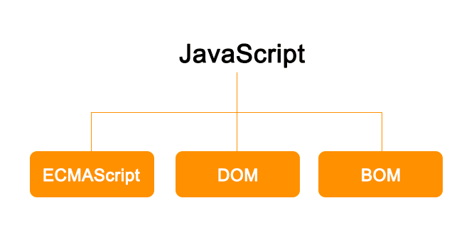
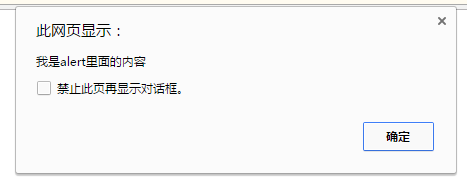

# JavaScript 第一天

## 一、JavaScript 概述

### 1.1 JavaScript 简介

前端的三层：

> ​	结构层	html			从语义的角度搭建网页结构
>
> ​	样式层	css			从装饰的角度美化页面
>
> ​	行为层  Javascript	从交互的角度描述我们的页面行为

用途：数据验证、读写HTML元素、与浏览器窗口及其内容的交互效果、网页特效、WEB游戏制作

​	基于Node.js技术进行服务器端编程


### 1.2 javascript 发展史

​	在WEB日益发展的同时，网页的大小和复杂性不断增加，受制于网速的限制，为完成简单的表单验证而频繁地与服务器交换数据只会加重用户的负担，当时走在技术革新最前沿的Netscape（网景）公司，决定着手开发一种客户端语言，用来处理这种简单的验证。
​	1995年，就职于Netscape 公司的布兰登·艾奇（Brendan Eich），开始着手为即将于1996年2月发布的Netscape Navigator 2浏览器开发一种名为LiveScript 的脚本语言。为了尽快完成LiveScript 的开发，Netscape 与Sun 公司建立了一个开发联盟。在Netscape Navigator 2 正式发布前夕，Netscape 为了搭上媒体热炒Java 的顺风车，临时把LiveScript 改名为JavaScript。
​	由于JavaScript1.0获得的关注度越来越高，1996年，微软就在其Internet Explorer 3 中加入了名为JScript 的JavaScript 实现，这意味着有了两个不同的JavaScript 版本，导致JavaScript没有一个标准化的语法和特性。
    1997 年，以JavaScript 1.1 为蓝本的建议被提交给了欧洲计算机制造商协会（ECMA，
European Computer Manufacturers Association）。该协会指定39 号技术委员会（TC39，Technical Committee #39）负责“ 标准化一种通用、跨平台、供应商中立的脚本语言的语法和语义”。TC39 

由来自Netscape、Sun、微软、Borland 及其他关注脚本语言发展的公司的程序员组成，他们经过数月的努力完成了ECMA-262标准，定义一种名为ECMAScript的新脚本语言。布兰登·艾奇（1961年～），JavaScript的发明人，目前（2005年至2014年）在Mozilla公司担任CTO。2014年4月3日，出任Mozilla的CEO十天就被迫辞职。


### 1.3 ECMAScript 版本发展

​	1998年6月，ECMAScript 2.0版发布。

​	1999年12月，ECMAScript 3.0版发布，成为JavaScript的通行标准，得到了广泛支持。

​	2007年10月，ECMAScript 4.0版草案发布，对3.0版做了大幅升级。草案发布后，由于4.0版的目标过于激进，各方对于是否通过这个标准，发生了严重分歧。以Yahoo、Microsoft、Google为首的大公司，反对JavaScript的大幅升级，主张小幅改动；以JavaScript创造者Brendan Eich为首的Mozilla公司，则坚持当前的草案。

​	2008年7月，由于各方分歧太大，争论过于激进，ECMA开会决定，中止ECMAScript 4.0的开发，将其中涉及现有功能改善的一小部分，发布为ECMAScript 3.1，而将其它激进的设想扩大范围，放入以后的版本。会议气氛和谐，故该版本的项目代号起名为Harmony（和谐）。会后不
久，ECMAScript 3.1就改名为ECMAScript 5。

​	2009年12月，ECMAScript 5.0版正式发布。Harmony项目则一分为二，一些较为可行的设想定名为JavaScript.next继续开发，后来演变成ECMAScript 6；一些不是很成熟的设想，则被视为JavaScript.next.next，在更远的将来再考虑推出。

​	2011年6月，ECMAscript 5.1版发布，并且成为ISO国际标准（ISO/IEC 16262:2011）。

​	2013年3月，ECMAScript 6草案冻结，不再添加新功能。新的功能设想将被放到ECMAScript 7。

​	2013年12月，ECMAScript 6草案发布。然后是12个月的讨论期，听取各方反馈。

​	2015年6月17日，ECMAScript 6发布正式版本，即ECMAScript 2015。

​	2015版本也就是6版本，将来在我们最后面的课程。

### 1.4 JavaScript 脚本语言

Javascript，JScript，ActionScript等脚本语言都是基于ECMAScript标准实现的。

在JavaScript，JScript和ActionScript中声明变量，操作数组等语法完全一样，因为它们都是ECMAScript。但是在操作浏览器对象等方面又有各自独特的方法，这些都是各自语言的扩展。

JavaScript是由ECMAScript，DOM和BOM三者组成的。

JavaScript语言简称JS。



### 1.5 JavaScript 书写位置

JavaScript 是一门弱类型动态的脚本语言。在页面中使用JavaScript有三种方式：

* **行内式**：在元素的事件属性中书写，由于写在html中，导致代码冗余，因此不常用。

    ​	如：onclick属性等
css也有行内式，style标签
* **内嵌式**：可以书写body标签内部的一对script标签中（学习中常用）。

    ​	script标签有一个属性type,属性值是“text/javascript”表示书写的是纯文本的javascript语言。

* **外链式**：通过外部引入js文件，将引入文件书写head标签内部（工作中常用），通过 src 属性引入文件地址。

    ​	JavaScript 文件扩展名是.js，JavaScript 也可以简称 js

    ​	js文件的书写：直接在js文件中书写我们想显示的内容。

    ​	js脚本语言不能直接在浏览器中加载，必须依托html载体实现。

```html
<!DOCTYPE html>
<html lang="en">
<head>
    <meta charset="UTF-8">
    <meta name="viewport" content="width=device-width, initial-scale=1.0">
    <title>Document</title>
    <!-- 2 内嵌式  -->
    <!-- <script type="text/javascript"></script> -->
    <!-- 3 外链岁 -->
    <!-- <script type="text/javascript" src="./js/01.js"></script> -->
</head>
<body>
    <!-- 1 行内式 -->
    <button onclick="">按钮</button>
    <!-- 2 内嵌式  -->
    <script type="text/javascript"></script>
    <!-- 3 外链岁 -->
    <script type="text/javascript" src="./js/01.js"></script>
</body>
</html>
```


### 1.6 alert

alert() 方法是js内置的方法（功能）。直接调用不用书写调用对象。

alert()表示弹出框，警告框。

alert()方法后面直接跟小括号()，小括号内书写内容，内容需要使用双引号包裹，语句结束必须书写分号。

js解析器的工作原理：js解析器是一条一条语句解析的，当看到分号时，知道这是一条语句的结束。如果没有分号，解析器会一直解析直到遇见分号。所以书写js语句要求大家每一条语句必须用分号结尾。

下面这段代码可以正常解析，因为每一行语句都换行。但是不能这样书写。因为js代码在上线前会压缩代码，将所有的换行，空格，缩进都删掉，如：

​	alert("第一条语句")

​	alert("第二条语句")	



### 1.8 语句

分号的重要性

​	每一条js语句必须书写分号，标识每一行语句的结束，提高解析器的工作效率

alert（）语句的执行顺序

​	从上到下顺序执行（包括多个 script 标签）。

alert()语句对空格，缩进，换行不敏感
alert()要把这个窗口关了才能继续运行alert下面的代码，即会中断程序执行

```html
<!DOCTYPE html>
<html lang="en">
<head>
    <meta charset="UTF-8">
    <meta name="viewport" content="width=device-width, initial-scale=1.0">
    <title>Document</title>
    <style>
        button {
            /* 写在一行，必须用;隔开 */
            color: red; font-size: 50px;
        }
    </style>
</head>
<body>   
    <!-- 双引号中只能嵌套单引号，单一号中只能嵌套双引号 -->
    <!-- 注意：这里的分号，冒号，引号，逗号等等必须是英文的，不能是中文的 -->
    <!-- 注意，在html规范中，属性值要使用双引号，因此建议属性值使用双引号，内部使用单引号 -->
    <button onclick="alert('hello')">按钮</button>
    <!-- <button onclick='alert("hello")'>按钮</button> -->
    <script type="text/javascript" src="./js/01.js"></script>
    <script type="text/javascript">
        // 分号表示一句话的结束
        alert('第一句话1111');
        alert("第二句话2222");
    </script>
</body>
</html>
```


### 1.9 JavaScript 注释

**单行注释**：只能注释单行文本，如果换行将报错。

​	如：// 单行注释

​	快捷键：ctrl + /

**多行注释**：可以一次注释多行文本

​	如：/*

​			多行注释，

​			可以一次注释多行文本

​		*/

​	快键键：ctrl +shift + /

```html
<!DOCTYPE html>
<html lang="en">
<head>
    <meta charset="UTF-8">
    <meta name="viewport" content="width=device-width, initial-scale=1.0">
    <title>Document</title>
</head>
<body>
    <script>
        // 单行注释只能注释掉单行文本
        // hello 
        // ickt

        // 多行注释
        /* hello 
        
        
        ickt */

    </script>
</body>
</html>
```


### 1.10 console 面板

一般使用谷歌浏览器的控制台，是我们“审查元素”或者“检查”里面的一个功能面板，英文写作console，控制台的意思，快捷键是F12.

控制台会汇总我们代码中出现的错误，指出错误的类型，数量。

​	方便我们程序员调试代码。

控制台也可以输出一些内容，输出内容直接在控制台显示。

​	语句：console.log();就是打印

​		console本身也是js内置的一个对象，对象里有一个方法，叫做log，本身是日志的意思。

​		console.log()语句的作用是在控制台输出打印一些内容。

​	作用：可以在控制台直接书写一些语句。

```html
<!DOCTYPE html>
<html lang="en">
<head>
    <meta charset="UTF-8">
    <meta name="viewport" content="width=device-width, initial-scale=1.0">
    <title>Document</title>
</head>
<body>
<script>
    // hello
    // ickt
    // console语句输出内容
    console.log('hello');
    // 工作中，我们常常使用console去调试
    // alert(111);
    // console不会中断执行，alert会中断程序执行
    console.log(100);
</script>
</body>
</html>
```


## 二、字面量

### 2.1 字面量

字面量（literal）是用于表达一个固定值的表示法。也叫做直接量，或者叫常量。

​	说白了，字面量就是字面的意思，我们看到什么，就表示什么，值是确定不变的。

字面量可以用于表示固定值，

​	比如：数字、字符串、undefined、布尔类型的字面值等。

​	今天学习：数值字面量、字符串字面量

### 2.2 数学字面量

数字字面量就是我们常用的数字，没有任何其他辅助符号。

​	数字分类：**整数**、**浮点数（小数）**、**特殊值**

**整数字面量**

​	整数可以被表示成十进制（基数为10）、八进制（基数为8）以及十六进制（基数为16）。

- ​		十进制是最基本的数值字面量格式，可以直接在代码中输入。
- ​		八进制字面值必须带前导0、0O、0o 。八进制整数只能包括数字0-7。
        注：0o8会报错，08会认为是十进制的8，0o18，018同理
- ​		十六进制的前缀是0x或0X。后面可以包含数字（0-9）和字母a~f或A~F。

​	在进行算术计算时，所有八进制和十六进制的数字都会被转换成十进制。

**浮点数字面量**：

​	浮点数：整数.小数。

​	有几种字面量表示方法。有整数位，没有整数位，负数，幂的表示方法（科学计数法）
    0.12e4就是1200 1200e-4就是0.12
​	重点记忆：幂的表示法。

​	浮点数，只有十进制有浮点数，八进制和十六进制都没有。

```html
<!DOCTYPE html>
<html lang="en">
<head>
    <meta charset="UTF-8">
    <meta name="viewport" content="width=device-width, initial-scale=1.0">
    <title>Document</title>
</head>
<body>
<script>
// 通过console.log将数据打印到console面板中
// // 整型
// console.log(100);
// console.log(-100);
// console.log(999);

// // 进制
// console.log(11);
// // 8进制
// console.log(011);
// console.log(0O11);
// console.log(0o11);
// console.log(0o17);
// // 在8进制中，当数字超过7就会报错。
// // console.log(0o19);
// // 如果以0开头的8进制数，如果数字大于7将作为10进制处理
// console.log(017);
// console.log(018);

// // 十六进制
// console.log('------ 十六进制 ------');
// console.log(0x11);
// console.log(0X11);
// console.log(0X1f);
// console.log(0X1F);
// // 十六进制中，字母不能超过F
// // console.log(0X1g);

// // 不论是什么进制，做算术运算的时候，结果为10进制
// console.log(0O12 * 2);
// console.log(0x12 * 2);


// 浮点数
// 有整数位
console.log(20.12);
console.log(0.12);
// 省略
console.log(.12);
// 有负数
console.log(-10.12);
// 幂的形式
console.log(0.12e4)
console.log(0.12e-4)
</script>
</body>
</html>
```


**两个特殊值**：

​	**Infinity**，表示无穷大。我们的计算机的计算能力有限，有一个最大的计算值，有一个最小的计算值，超出这个范围，数字会输出为Infinity，

或者-Infinity。

​	**NaN,**英文not a number，不是一个数字，奇怪的是，它本身是一种数字的字面量。将字符串转成数字是nan console.log(+'hello'); 0/0是nan

```html
<!DOCTYPE html>
<html lang="en">
<head>
    <meta charset="UTF-8">
    <meta name="viewport" content="width=device-width, initial-scale=1.0">
    <title>Document</title>
</head>
<body>
<script>
// 无穷数（超过1.7976931348623157e+308）
console.log(1.7976931348623157e+308);
console.log(1.7976931348623157e+309);
console.log(1/0);
console.log(-1/0);
// 特殊单词表示
console.log(Infinity)
console.log(-Infinity)

// 如果一个小数比较接近0（小于5e-324），计算机还无法表示，此时将作为0来处理
console.log(5e-324);
console.log(5e-325);
// 如果负数比较接近0，计算机无法表示，将变成-0
console.log(-5e-324);
console.log(-5e-325);

// 非数字
console.log(NaN);
// 将字符串转成数字是nan
console.log(+'hello');

// 可以通过0和1来实现-Infinify, +Infinify， 0， -0， NaN
console.log('---------------------');
console.log(-1/0);
console.log(1/0);
console.log(0/1);
console.log(0/-1);
console.log(0/0);

</script>
</body>
</html>
```


### 2.3 字符串

字符串，就是我们人类说的语言。包括各种类型的语言，特殊符号，说话中的数字。

字符串字面值可以包含零个或多个字符，由双引号对或单引号成对包围。字符串被限定在同种引号之间；也即，必须是成对单引号或成对双引

号。

​	在字符串中可以使用一些特殊字符，比如

​		\n	换行                 	

​		\t	Tab制表符	 

​	字符串中可以使用转义字符反斜杠\，

​		\'	单引号			

​		\”	双引号			

​		```\\```	反斜杠

```html
<!DOCTYPE html>
<html lang="en">
<head>
    <meta charset="UTF-8">
    <meta name="viewport" content="width=device-width, initial-scale=1.0">
    <title>Document</title>
</head>
<body>
<script>
// 字符串
console.log("你好");
console.log('hello');
// 成对出现的
// console.log('hello");
// console.log("hello');
// 单引号与双引号之间是可以相互嵌套的(只能嵌套一层，但是可以多次使用)(单引号字符串中，只能双引号，双信号字符串中，只能出现单引号)
console.log("hello' 'i'c''kt'");
console.log('hello" "ic"kt"');
// 想嵌套同类引号，要使用转义字符
console.log("hello \" ickt");
console.log('hello \' ickt');
// \表示转义符号，可以对任何字符转义，
// 第一个\对第二个\进行了转义，第三个斜杠对'进行转了
console.log('hello \\\' ickt');
console.log('hello \\   \' ickt');
// 如果在字母前添加\字母也会转义
// 字符串不能换行，想换行使用\n
// console.log('hello 
// ickt');
console.log('hello \nickt');
// 并不是所有的字符转义都有意义
console.log('\h\e\l\l\o \nickt');
// 注意：转义字符串是一个整体，不能拆开使用
console.log('h e\tllo \n \ n \nickt');
</script>
</body>
</html>
```


## 三、变量

### 3.1 变量

变量：variable（变量）

​	变量是变化的量，可以把变量看成可以盛放数据的容器。变量盛放可以是任何数据类型，比如字面量，函数，数组等。

​	变量输出的是变量存放的数据，而不是变量名。

​	当变量有多个赋值时，输出的是最后一次赋值，前面（旧的）赋值直接被舍弃。

### 3.2 变量声明

变量（Variables）声明，也叫定义变量或创建变量，可以用来保存任何类型的数据。

​	变量声明必须使用一个关键字var，关键字后面必须跟一个空格，然后再跟我们定义的变量名称。

​	变量必须先声明（关键字var）再使用。访问一个没有声明的变量，将抛出ReferenceError（引用错误）错误

​	变量名本身叫做标识符，任何标识符的命名都需要遵守一定的规则。

​		只能使用字母、下划线（_）、美元符号（$）或数字，但是不能是数字开头。

​	因为JavaScript语言是区分大小写的，这里所指的字母可以是（大写的）“A”到字母“Z”和（小写的）“a”到“z”。并且不能是JavaScript的关键字和保留字。

​	关键字：是一些拥有特殊功能的单词。

​		break　　do　　instanceof　　typeof　　case　　else　　new　　var　　catch　　finally　　return　　void　　continue　　for　　switch　　while　debugger*　　  function　　this　　with　　　　default　　if　　throw　　delete　　in　　try　

​	保留字：也是一些单词，本身没有特殊功能，但是在将来有可能做为关键字。

​		abstract　　enum　　int　　short　　boolean　　export　　interface　　static　　byte　　extends　　long　　super　　char　　final　　native　　class	synchronized　　float　　package　　throws　　const　　goto　　private　　transient　　debugger　　implements　　protected　　volatile　　double　　import　　public

### 3.3 变量赋值

变量声明的时候，没有给它赋初值，计算机会给我们一个默认的值，undefined（未定义）。表示你可以往变量里存放其他任意类型的数据。

​	等号表示赋值，会将=右边的值，赋给=左边的变量。

​	变量赋值时，=左边的变量值改变，=右边的值是不变的。

​	变量声明只用一次，可以多次给变量赋值，不用重复写var。

​	我们习惯写法：一般我们习惯将变量的声明和赋值书写成一条语句。

 多个变量的声明：一个var可以声明多个变量，用逗号隔开
        **1、变量声明完没赋值直接调用会出现undefined**
        **2、变量声明完可以多次赋值，赋值很多次后最后的那个是这个变量的值，当然是从上到下调用，调用是调用从上到下的顺序找最近的那个赋值**

```html
<!DOCTYPE html>
<html lang="en">
<head>
    <meta charset="UTF-8">
    <meta name="viewport" content="width=device-width, initial-scale=1.0">
    <title>Document</title>
</head>
<body>
<script>
// 变量
var ickt;

// 为变量赋值
ickt = 100;

// js按照从上到下的顺序执行，因此此时还没有更改成hello
console.log(ickt)

// 继续赋值
ickt = 'hello';

console.log(ickt);

// 变量名规则
var a;
var ickt100;
var ickt_100;
var ICKT$100;
// 不能以数字开头
// var 100ickt;
// 可以以$或者_开头
var $100;
var $abc;
var _100;
var _ABC;

// 不能使用关键字或者表刘子
// var function;
// var for;
// var class;

// 工作中，不建议使用中文
// var 你好;
// 你好 = 200;
// console.log(你好)


// // 声明变量
// var color;
// // 变量赋值
// color = 'red';
// // 多次赋值
// color = 'green';
// color = 'blue';
// // var使用一次就可以，不需要重复声明
// var color = 'orange';

// 变量的赋值和声明可以写在一起
// var color = 'red';
// var num = 100;
// var title = '爱创课堂';
// 简写：将分号变成逗号（建议）
var color = 'green',
    num = 200,
    // 分号表示赋值完成
    title = '爱创课堂';
console.log(color);
console.log(num);
console.log(title);
</script>
</body>
</html>
```


### 3.4 声明提升

**概念**：JavaScript 变量的另一特别之处是，**你可以引用稍后声明的变量**，而不会引发异常。这一概念称为变量声明提升(hoisting)；赋值并没有提升

**解释**：JavaScript 变量感觉上是被“举起”或提升到了所有函数和语句之前。然而提升后的变量将返回 undefined 值，所以即使在使用或引用某个变量之后存在声明和初始化操作，仍将得到 undefined 值。

**原理**：如果我们先引用一个变量，变量在后面定义，计算机有一个预解析的过程，会去全局范围查找是否有定义过变量，会将所有的定义的变量的声明提升到所有代码的最前面。后面加载代码的时候，能够找到这个定义的变量。

**变量声明提升**：只提升声明（定义），不提升赋值。

```html
<!DOCTYPE html>
<html lang="en">
<head>
    <meta charset="UTF-8">
    <meta name="viewport" content="width=device-width, initial-scale=1.0">
    <title>Document</title>
</head>
<body>
<script>
// 运行js之前，先预览代码，将变量的声明放到代码的最前面。
// 只是声明的提升，赋值没有提升。


// 声明提升有的人也称之为声明前置
console.log(ickt)
var ickt;
// 声明了变量
// var ickt = 100;
// 声明
// var ickt;
// 赋值
ickt = 100;

// 已经赋值了，所以可以访问到
console.log(ickt)

</script>
</body>
</html>
```

# JavaScript 第二天

## 复习

Javascript： ECMAScript， BOM， DOM

引入js： 行内式， 内嵌式， 外链式

​	自上而下的顺序执行

alert		console.log

注释： //    /**/

语句 

字面量

​	数字字面量	

​		整型	10进制，8进制 0， 0O, 0o，16进制 0x， 0X 

​		浮点型	幂的形式		1.23e4

​		特殊值	Infinity	  NaN

​	字符串字面量	""  ''		```\" \' \\``` 	\n	\t

变量	var name;

​	关键字和保留字

​	赋值： name = value;

​	var name1 = val1, name2 = val2;

​	声明提升

## 一、数据类型

### 1.1 数据类型

不管是字面量、变量、函数、数组，这些都有自己的数据类型。

简单数据类型：

> ​	number 		数字类型，包括所有的整数、浮点数、特殊值	
>
> ​	string		字符串类型，所有的字符串都是字符串类型
>
> ​	boolean 		布尔类型，仅有两个值true 和 false
>
> ​	undefined 	undefined类型，变量未定义时的值，这个值自己是一种类型

​	注： 数字类型里：不再区分整数、浮点数、Infinity、NaN，都是Number类型。

复杂数据类型：object                 后面的课程我们细说，

​	注：null表示空对象，有的人也把null单独看成一种类型（后面细说）。

### 1.2 数据类型检测

typeof 	

​	操作符，typeof() 括号可以使用或者不使用

​	typeof本身是一个关键字，检测的数据可以写在空格后面。

变量数据类型：

​	JavaScript是一种动态类型语言(dynamically typed language)。

​	变量的类型根据内部的数据而确定的。

​	但是变量内容是可以变动，数据类型会根据内容的变化而变化。
    因为声明变量全是var，跟着变量的内容去转换数据类型，不像java声明变量是int a =10；

```html
<!DOCTYPE html>
<html lang="en">
<head>
    <meta charset="UTF-8">
    <meta name="viewport" content="width=device-width, initial-scale=1.0">
    <title>Document</title>
</head>
<body>
<script>
// 变量
// 数字
var a = 100,
    // 字符串
    b = 'hello',
    // 布尔值
    c = true,
    // undefined
    d;
var leixing = typeof a;
console.log(leixing);//出现number
// // 打印结果
// console.log(a);
// console.log(b);
// console.log(c);
// console.log(d);

// // 查看数据类型
// // typeof 可以是关键字
// console.log(typeof a);
// // 还可以是方法： 后面加上()
// console.log(typeof(b));
// console.log(typeof c);
// console.log(typeof d);

// 其它数据
console.log(typeof true);
console.log(typeof false);

console.log(typeof undefined);

console.log(typeof 'hello');
console.log(typeof "ickt");
console.log(typeof '100');
console.log(typeof '0.12');

// 数字
console.log(typeof 100);
console.log(typeof 0.12);
console.log(typeof 1.23e4);
console.log(typeof -20);
console.log(typeof Infinity);
console.log(typeof NaN);


</script>
</body>
</html>
```


### 1.3 数据类型转换

数字转字符串（数字＋空字符串。）：

​	加号：在不同数据类型之间使用时，尤其是数字和字符串类型，加号表示连接符，将数字和字符串拼接，得到的结果是字符串。
    **数字+字符串=字符串，把数字作为字符串与字符串拼接**
    **数字+true=数字+1，把true当成1，同理false被认为是0**
    **true+字符串=true"字符串"，把true当成字符串"true"去和字符串拼接，  false同理**

​	注：数字与数字类型之间，就是正常的运算符。

字符串转数字：

​	有2个函数可以把非数值转换为数值：parseInt()和parseFloat()。

```html
<!DOCTYPE html>
<html lang="en">
<head>
    <meta charset="UTF-8">
    <meta name="viewport" content="width=device-width, initial-scale=1.0">
    <title>Document</title>
</head>
<body>
<script>
// 将数字转成字符串
var num = 100;
var num2 = 200;
var str = 'hello';

// 拼接在一起
// var result = num + str;
// 在运算的时候转换的也称之为隐形转换。
// var result = str + num;
// 数字的加法
var result = num + num2;
console.log(result)
console.log(typeof result)
</script>
</body>
</html>
```


### 1.4 parseInt:将字符串转化为正数

​	parseInt也有两个参数，

​		第一参数是要转的字符串（可以省略前缀）

​		第二个是进制(0，10以及默认值都是10位，最多36位),传1或者负数得到nan
console.log(parseInt('100') 100
console.log(parseInt('123.456') 123 即取整
parseInt('123abc456') 123，注：次幂的话，要么保留正数部分，要么保留e前面的
    即把次幂e看做了字母
​parseInt作用：可以对数字进行取整。
parseInt('aaa123abc456'） NaN
parseInt(011)：9 8进制转成了10，同parseInt(011,8)
    注意如果前面有进制，后面再添一个，一定要统一，如果不统一会出现nan
parseInt(10,1或者-4) ：nan
​	进制的问题：由于ECMAScript 3 和 5存在着分歧，调用 parseInt()方法时最
好总是带上进制(radix) 参数，这个参数用于指定使用哪一种进制。

如果指定了进制，那字符串前可以不带前缀“0”、“0o”、“0x”。

### 1.5 parseFloat

​	将字符串转为浮点数。就是将字符串转换为浮点数，直接省略第一个小数点后其他非数字的东西。
parseFloat('1.23.456') ：1.23
parseFloat('1.23abc')：1.23
parseFloat('abc1.23abc'):nan
**parseFloat(1.23e4):12300，它能识别次幂e**
parseFloat可以识别进制，比如0o11能出来17，但是它没第二个参数的！

**同时：+可以将字符串转成数字(隐形转换)**
+出现在字符串前面会将字符串转成数字
+只能隐形转化正确的数字，比如次幂，e，进制等，出现第二个.或者其它数字会出现nan

```html
<!DOCTYPE html>
<html lang="en">
<head>
    <meta charset="UTF-8">
    <meta name="viewport" content="width=device-width, initial-scale=1.0">
    <title>Document</title>
</head>
<body>
<script>
// console.log(typeof '100');
// // console.log 可以传递多个参数，参数之间用逗号隔开
// // parseInt方法优先级高于typeof，因此会先执行
// console.log(parseInt('100'), typeof parseInt('100'));
// // 只能取整
// console.log(parseInt('123.456'), typeof parseInt('123.456'));
// // 会保留字母前面的数字
// console.log(parseInt('123abc456'), typeof parseInt('123abc456'));
// // 如果字母前面没有数字，将得到NaN
// console.log(parseInt('aaa123abc456'), typeof parseInt('aaa123abc456'));
// // parseInt会保留字母前面的或者是小数点掐面的。
// // 幂
// console.log(parseInt('1.23e4'), typeof parseInt('1.23e4'));

// // 对数字取整
// console.log(parseInt(1.23e4), typeof parseInt(1.23e4));
// 可以携带进制前缀,得到的结果是10进制的
// console.log(parseInt(011));
// console.log(parseInt(0O11));
// console.log(parseInt(0o11));
// console.log(parseInt(0X11));
// console.log(parseInt(0x11));
// // 第二个参数表示进制
// console.log(parseInt(11, 5));
// console.log(parseInt(11, 18));
// // 0和10以及默认值，都是10进制
// console.log(parseInt(11, 0));
// console.log(parseInt(11, 10));
// console.log(parseInt(11));
// // 1以及负数将得到NaN
// console.log(parseInt(11, 1));
// console.log(parseInt(11, -1));
// // 最多36进制
// console.log(parseInt(11, 36));
// console.log(parseInt(11, 37));
// // 如果前面有前缀，不要添加进制
// console.log(parseInt(011, 6));

// // 处理小数
// console.log(parseFloat('1.23'));
// console.log(parseFloat('1.23.456'));
// console.log(parseFloat('1.23abc'));
// console.log(parseFloat('abc1.23abc'));
// // 数字
// console.log(parseFloat(123));
// console.log(parseFloat(1.23e4));
// console.log(parseFloat(1.23e-4));
// console.log(parseFloat(0x11));
// // 第二个参数无意义，不是表示进制
// console.log(parseFloat(11, 12));

// +可以将字符串转成数字(隐形转换)
console.log(+10)
// +出现在字符串的前面，会将字符串转成数字
console.log(typeof '10', typeof +'10', +'10')
// 可以包含小数
console.log(typeof +'10.123', +'10.123')
// +只能隐形的转换正确的数字（只有一个小数点）
console.log(+'10.123.456')
console.log(+'1.123e4')
console.log(+'1.1a23e4')
console.log(+'011')
console.log(+'0O11')
console.log(+'0x11')
// 工作中，不太注意转换细节的时候，可以使用+转换
// +作用
// 表示正数符号         +10
// 字符串片接符号       'abc' + 'efg'
// 数字加法             5 + 6
// 数字的隐形转换       +'123'

</script>
</body>
</html>
```


## 二、运算符

### 2.1 运算符分类

运算符（Operators，也翻译为操作符），是发起运算的最简单形式。

分类：

> ​	数学运算符(Arithmetic operators)	
>
> ​	比较运算符(Comparison operators)
>
> ​	逻辑运算符(Logical operators)
>
> ​	赋值运算符(Assignment operators)
>
> ​	按位运算符(Bitwise operators)
>
> ​	条件 (三元) 运算符(Conditional operator)

### 2.2 数学运算符

数学运算符：  + - * / % ()
负数取余就是整数取余加负号

运算顺序：先算乘除取余，再算加减，遇见小括号先算小括号。

特殊运算：我们通常都是进行数字与数字的运算，我们还会进行一些特殊的数学运算。

​	**纯数字字符串与数字进行运算的时候，纯数字字符串会被隐式转换为数字， 参与运算，加法除外。（因为字符串拼接优先级高于加法）**

​	除了纯数字之外，还有布尔值和null会被隐式转换。

隐式转换:不用parseInt和parseFloat，自动将字符串转成了数字

​	记忆：true→1	false→0	      null→0	“123”→123

​	undefined，或者非纯数字字符串不会被隐式转换，得到的结果都是NaN

总结：

> ​	纯数字字符串与数字进行除加法之外的数学运算时，都能进行隐式转换。
>
> ​	特殊字符，布尔值，null与数字进行计算时，所有的数学运算中都能被隐式转换。
>
> ​	非纯数字字符串（比如"hello"）和undefined，不能进行隐式转换，与任何数字进行运算得到都是NaN。
>
> ​	任何数字和NaN进行运算，得到都是NaN。

0.1+0.2出现0.3000000000000004，但是0.1和0.3用二进制表示是无限不循环小数，
所以出现这个,因为js小数采用单精度浮点数的形式，
解决：乘10加法除以10
```html
<!DOCTYPE html>
<html lang="en">
<head>
    <meta charset="UTF-8">
    <meta name="viewport" content="width=device-width, initial-scale=1.0">
    <title>Document</title>
</head>
<body>
<script>
// console.log(2 + 3);
// console.log(2 - 3);
// console.log(2 * 3);
// console.log(2 / 3);

// // 求余
// console.log(5 % 3);
// // 负数也可以求余
// console.log(-5 % 3);

// // 浮点数加减法
// // 所有的数据都是以二进制进行存储的
// // 例如 5 => 101
// // 原因：js中小数采用的是单精度浮点数的形式
// console.log(0.1 + 0.2);
// console.log(0.5 + 0.25);
// // 不免精确的问题：转成整数解决
// console.log((0.1 * 10 + 0.2 * 10) / 10);
// console.log(0.4 - 0.1);

// // 乘，除，求余优先级是一样的
// console.log(4 + 5 * 2);
// console.log(4 + 5 % 2);
// console.log(4 * 5 / 2 % 5);
// console.log(4 % 5 * 5 / 2);
// console.log(4 % (5 * 5 / 2));
// // 优先级相同由左到右的顺序执行。
// console.log(4 + 5 - 2);


// 转换
console.log(true + 1);
console.log(false + 1);
// null 表示空对象
console.log(null + 1);
// 字符串拼接优先级要高于数字的加法
console.log('123' + 1);
// 字符串没有乘法，因此会作为数字处理
console.log('123' * 2);
// NaN和undefined作为NaN处理，NaN不论做什么运算，其结果都是NaN
console.log(undefined + 2);
console.log(NaN + 2);
console.log('hello' * 2);
console.log(Infinity + 2);
console.log(Infinity - 2);

</script>
</body>
</html>
```


### 2.3 Math对象，注意是个对象

Math对象是js内置一个功能强大的数学对象，里面包含了很所数学运算的属性和方法。

常用方法：

> ​	Math.random();		返回大于等于0小于1的一个随机数
>
> ​	Math.pow(num,power);   返回num的power次幂
>
> ​	Math.sqrt(num);		返回num的平方根
>
> ​	Math.PI				返回π的值

```html
<!DOCTYPE html>
<html lang="en">
<head>
    <meta charset="UTF-8">
    <meta name="viewport" content="width=device-width, initial-scale=1.0">
    <title>Document</title>
</head>
<body>
<script>
// 随机数
console.log(Math.random());
// 计算周长，半径是5 
console.log(2 * Math.PI * 5);
console.log(Math.PI);
// 幂
console.log(Math.pow(2, 4));
// 开方
console.log(Math.sqrt(100));
</script>
</body>
</html>
```


### 2.4 比较运算符

```
>		大于
<		小于
>=		大于等于
<=		小于等于
==		等于
!=		不等于
===		全等于
!==		不全等于

```
所有比较运算符参与的运算得到的结果都是返回布尔值。
	==，等于，判断两边关系的时候，它会尽可能去判断两边相等。
	===，全等于，判断的时候，会尽可能判断两边不等。除了判断值相等以外，还要判断数据类型是不是相同。
全等===判断**数据类型是否相等**
因为js小数会存在精度的问题，所以js会把数字尽可能转化成整数，比如输出100.0就是100

**特殊情况**：

​	特殊字符串与数字进行比较。

​		比较过程中：纯数字字符串会隐式转换为数字，true转为1,false转为0 ，null转为0，但是做相等和全等判断的时候，null不等于0.

​	字符串与字符串进行比较。比较的不是大小、长短，比较的是字符的Unicode编码顺序。顺序靠前的	小于顺序靠后的。字典序

​		字符编码顺序：数字（45），大写字母（69），小写字母（97）。

​		如果第一个字符相同，要依次寻找后面的字母进行判断，直到判断出大小。

​	有NaN参与的特殊情况：
    NaN==NaN：false，有问题
    NaN不等于任何数字
    0/1==0/-1:true，理论上应该不一样，一个是+0，一个是-0，es6给解决办法

​	有Infinity参与的特殊情况：
        js不会愚蠢到开辟很大空间存储infinity，所以当数字大了之后全是
    infinity，
        console.log(Infinity == Number.MAX_VALUE * 10) true
    
**比较字符：除非全等，剩下都被认为是转成数字之后再转换，全等就是比较大小还要比较数据类型**

```html
<!DOCTYPE html>
<html lang="en">
<head>
    <meta charset="UTF-8">
    <meta name="viewport" content="width=device-width, initial-scale=1.0">
    <title>Document</title>
</head>
<body>
<script>
// 比较运算符
// console.log(3 == '3')
// console.log(3 == '3a')
// console.log(30 === 30.00)true
// console.log(30 == '30.00')
// console.log(30 === '30.00')false
// console.log(3 >= 4)

// Infinity是变量，存储在同一个位置
// console.log(Infinity === Infinity) true
// console.log(Infinity == Infinity)
// console.log(Infinity == Number.MAX_VALUE * 10) true
// console.log(Infinity == Number.MAX_VALUE)
// console.log(Infinity == -Infinity)

// NaN, +0, -0
// console.log(NaN === NaN)
// console.log(0/1 === 0/-1)

// NaN不等于任何数字
// console.log(0 == NaN)

// null 比较的时候不会转成0
// 理解为转成布尔会做比较的
// console.log(null == undefined)
// console.log(null === undefined)

// 都转成数字
// console.log(false == undefined)
// console.log(false === undefined)

// console.log(false == 0)
// console.log(false === 0)

// console.log(true == 1)
// console.log(true == 2)

// console.log(+true);
// console.log(+false);
// console.log(+null);
// console.log(+undefined);
// console.log(+undefined == undefined);
// console.log(NaN == undefined);
// console.log(false == 0);
// console.log(null == 0);

// 字符串比较
console.log('abcd' < 'efg');
console.log('123' < 'efg');
console.log('abc' < 'abce');
console.log('abch' < 'abce');

</script>
</body>
</html>
```


### 2.5 逻辑运算符

逻辑运算符常用于布尔类型值之间; 当操作数都是布尔值时，返回值也是布尔值。

​	&&	逻辑与运算符

​	||	逻辑或运算符

​	!	逻辑非运算符，！！可以把任何数据类型转为boolean类型，相当于取反两次

特殊情况：

​	其它非布尔值也可以参与逻辑运算，参与的时候，会自动转换成布尔值进行运算，返回的结果就不一定是布尔值。
    null表示空对象
​	NaN、0、null、“”（空字符串）、undefined会转换成false参与运算。

​	非0数字、非空字符串都会转成true参与运算。

注意：&& 优先级高于 ||，建议在工作中，用()提高优先级，避免语义问题

### 2.6 短路语法

**逻辑与&&**

​	将逻辑与比喻成串联电路，判断过程，想象成电流通过的过程。

​	电流通过：

- ​		如果a为真，电流能够通过流通到b，结果就是b；
- ​		如果a为假，电流不能通过，停留在a，结果为a。


**逻辑或||**

​	将逻辑或比喻成并联电路，判断过程，想象成电流通过的过程。

​	电流通过：

- ​		如果a为真，电流直接从a完成循环，结果为a；
- ​		如果a为假，电流从a不能经过，流经到b，我们结果是b。


练习1：	false || !false && false || true;

练习2：	4 && "hello" || !false || !true && null;

```html
<!DOCTYPE html>
<html lang="en">
<head>
    <meta charset="UTF-8">
    <meta name="viewport" content="width=device-width, initial-scale=1.0">
    <title>Document</title>
</head>
<body>
<script>
// 与，或，非
// console.log(true && true)
// console.log(true && false)
// console.log(true || false)
// console.log(false || false)
// console.log(!true)
// console.log(!false)

// !!可以将任何数据转成布尔值。
// console.log(!!false);
// 对任何数据求布尔值
// console.log(!!0);
// console.log(!!'');
// console.log(!!NaN);
// console.log(!!null);
// console.log(!!undefined);
// console.log(!!false);
// // 其余的数据，转成布尔值都是true
// console.log(!!Infinity);
// console.log(!!100);
// console.log(!!'hello');

// // 短路语法
// console.log('hello' && 100); 100
// console.log(0 && 100); 0
// // 逻辑或
// console.log('hello' || 100); 'hello'
// console.log(0 || 100); 100

// 联系
// console.log(false || !false && false || true);  // true
// console.log(false || !false && false || 100);   // 100
// // console.log(false || (!false && 200) || 100);     // 200
// console.log(false || false && 200 || 100);      // 100
// console.log(false || (false && 200) || 100);      // 100

// console.log(4 && "hello" || !false || (!true && null));
console.log(4 && "hello" || !false || !true && null);


</script>
</body>
</html>
```


### 2.7 赋值运算符

赋值运算符是用右边的数据值为左侧的变量赋值。最简单的赋值运算符是等于（=），将右边的操作数值赋给左边的操作数（变量）。那么 x = y 

就是将 y 的值赋给 x。

含义：将右侧的数据运算之后，赋值给左边。

> ​	=		直接赋值，将等号右侧值直接赋值给左侧的变量
>
> ​		在变量原基础上，进行右侧的运算，将运算的值再赋值给左边的变量。
>
> ​	+=		加等于
>
> ​	-=		减等于
>
> ​	*=		乘等于
>
> ​	/=		除等于
>
> ​	%=		取余等于
>
> ​	++		递加
>
> ​	--		递减

**顺序**：贴身的（! ++ --）→ 数学 → 比较 → 逻辑 → 赋值

练习1：

​	var a = 4;

​	var sum = 1 * (2 + 3) && a++ || 5 > 6 && 7 < 8 || 9;

练习2：

​	var a = 4;

​	1 + 2 && 3 * a++ % 5 || 6 < 7 == 8 / !false

```html
<!DOCTYPE html>
<html lang="en">
<head>
    <meta charset="UTF-8">
    <meta name="viewport" content="width=device-width, initial-scale=1.0">
    <title>Document</title>
</head>
<body>
<script>
// 赋值
var a = 10;
// 让a加上5；
// a = a + 5;
// 简便写法
// a += 5;
// a -= 5;
// a *= 5;
// a /= 5;
// a %= 5;
// 让a加一或者减一
// a = a + 1;
// 简写
// a++
// a--
// 还可以写在变量前面
// ++a
// --a;
// 自加自减运算符会返回原来的变量
// console.log(a);
// console.log(++a);
// console.log(a++);
// console.log(a);

// ++ 或 -- 写在前面，会先运算，后返回变量
// ++ 或 -- 写在后面，会先返回变量，后运算

// var a = 4;
// var sum = 1 * (2 + 3) && a++ || 5 > 6 && 7 < 8 || 9;
// // sum = 5 && 4 || false && true || 9;
// console.log(sum);

var a = 4;
// 1 + 2 && 3 * 4 % 5 || 6 < 7 == 8 / true
// 1 + 2 && 2 || 6 < 7 == 8 / 1
// 3 && 2 || 6 < 7 == 8
// 3 && 2 || false
console.log(1 + 2 && 3 * a++ % 5 || 6 < 7 == 8 / !false);

// 1 + 2 && 3 * 4 % 5 || 6 < 7 == 8 / true
// 3 && 2 || 6 < 7 == 8
// 3 && 2 || false

</script>
</body>
</html>
```

# Javascript 第三天

## 一、运算符

### 1.1 三元运算符

三元表达式又叫三元运算符。

​	三元表达式是唯一一个需要三个元素参与的表达式：? :

​	结构：     条件表达式 ?   值1 : 值2

> ​		当表达式为真时，取值是值1.
>
> ​		当表达式为假时，取值是值2

```html
<!DOCTYPE html>
<html lang="en">
<head>
    <meta charset="UTF-8">
    <meta name="viewport" content="width=device-width, initial-scale=1.0">
    <title>Document</title>
</head>
<body>
<script>
// 三元表达式
// var a = 2 > 3 ? 5 : 6;
// alert(a);
// 输入分数
var num = prompt('请输入分数');
// 判断结果
// 输入的是字符串，要转成数字再比较
var result = +num < 60 ? '不及格' : '及格'
alert(result);
</script>
</body>
</html>
```


### 1.2 位运算

位运算就是针对二进制进行运算的运算符。

注：负数是以补码的形式表示的。 

​	例如：如果是一个8位的有符号整数，这个二进制数应该表示为00001101，最高一位是符号位。

​	负数的话，先置符号位为1，剩下的位按位取反，末位加1，最后的结果是11110011。

​	js中，采取32位来存储数据。

| **运算符** | **说明**     |
| ---------- | ------------ |
| &          | 与           |都是1才是1
| \          | 或           |有一个1就是1
| ~          | 非           |按位取反
| ^          | 异或         |相同为0，不同为1
| <<         | 零填充左位移 |
| >>         | 有符号右位移 |
| >>>        | 零填充右位移 |

```html
<!DOCTYPE html>
<html lang="en">
<head>
    <meta charset="UTF-8">
    <meta name="viewport" content="width=device-width, initial-scale=1.0">
    <title>Document</title>
</head>
<body>
<script>
// // 按位与
// console.log(5 & 1)
// // 按位或
// console.log(5 | 1)

// console.log(5 & 2)
// console.log(5 | 2)

// 非
// console.log(~5)：-6，正好是-5-1，
// console.log(~-1)

// 异或
// console.log(5 ^ 1)
// console.log(5 ^ 2)

// 左移
console.log(5 << 1)，后面添了个0，即乘2=10
// 右移
console.log(5 >> 1)  0101右移，010，变成2
// 填充0
console.log(5 >>> 1) 0101右移，2
// 负数
console.log(-5 >> 1) -3
// 填充0
console.log(-5 >>> 1) 符号位被阔充成0了，直接数字爆炸
</script>
</body>
</html>
```


### 1.3 运算符优先级

| **运算符**                         | **描述**                                     |
| ---------------------------------- | -------------------------------------------- |
| . [] ()                            | 字段访问、数组下标、函数调用以及表达式分组   |
| ++ -- - ~ ! delete new typeof void | 一元运算符、返回数据类型、对象创建、未定义值 |
| * / %                              | 乘法、除法、取模                             |
| + - +                              | 加法、减法、字符串连接                       |
| << >> >>>                          | 移位                                         |
| < <= > >= instanceof               | 小于、小于等于、大于、大于等于、instanceof   |
| == != === !==                      | 等于、不等于、严格相等、非严格相等           |
| &                                  | 按位与                                       |
| ^                                  | 按位异或                                     |
| \|                                 | 按位或                                       |
| &&                                 | 逻辑与                                       |
| \|\|                               | 逻辑或                                       |
| ?:                                 | 条件                                         |
| = += -= *= /= %= op=               | 赋值、运算赋值                               |
| ,                                  | 多重求值                                     |

## 二、条件语句

### 2.1 流程控制语句

js执行顺序是从上到下的，想改变js执行顺序可以使用流程控制语句。

​	流程控制语句可以使某些语句先执行，某些语句不执行。

​	条件分支语句：（使用条件控制语句是否执行）

> ​		if语句，
>
> ​		三元表达式，
>
> ​		switch语句

### 2.2 if 条件语句

结构：

​	if …… else ……

​	如果……否则……

​	语法：	

​		if (条件表达式) {

​			执行的结构体1;

​		} else {

​			执行的结构体2;

​		}

​	条件表达式：该条件表达式会自行计算结果，返回布尔值。（true/false）

​	结构体：书写很多条js语句。并用 {} 包裹一起执行。

​	解释：

​		当条件表达式为 true，执行 if 语句后面紧跟的这个结构体。

​		当表达式为 false 时，执行 else 后面的结构体。

​	工作中，如果 if 语句逻辑很简单，我们可以使用三元表达式来代替。

**特点**

（1）可以省略不写 else 语句。表示当条件为假时，结束 if 语句，执行 if 语句后面的其他 js 语句。

> ​	if (condition) {}

（2）如果 if 或者 else 执行体只有一条语句，可以省略不写 {}。（平时不建议这样操作）

> ​	if (condition) else 

（3）定义多分支的if语句

> ​	if (condition) {} else if (condition) {} else if (condition) {} else {}

（4）多分支的if语句可以不书写else。表示不满足以上所有条件时，直接结束if语句。执行if语句后面其他的js语句。

（5）多分支的if语句只会执行一次结构体。不会反复执行结构体。（跳楼现象）

（6）殊途同归：if 语句后面的 js 语句，不管if语句是否执行，if语句后面的js语句都会执行。

> ​	总结：多分支的 if 语句，有跳楼现象，只会执行一次结构体。可以有多个 else if 但是只能有一个 else

（7）if 语句的嵌套：if 语句可以嵌套 if 语句，结构体执行必须同时满足两个 if 语句的条件。

**练习**

三元表达式有自身的优势：

​	当变量的取值是二选一的情况，可以使用三元表达式。

练习：

​	当工作年限为不满1年，工资小于8000，年终奖为工资倍数的1倍，否则是1.2倍；

​	当工作年限为不满2年，工资小于10000，年终奖为工资倍数的1.5倍，否则是1.7倍；

​	当工作年限为超过2年，工资小于13000，年终奖为工资倍数的2.3倍，否则是3倍；

备用选项：一般使用逻辑运算符进行书写。

注意：在条件体中，定义的变量，如果该条件体被执行了，条件语句外部可以访问该变量

​	工作中，我们通常将变量定义在外部

```html
<!DOCTYPE html>
<html lang="en">
<head>
    <meta charset="UTF-8">
    <meta name="viewport" content="width=device-width, initial-scale=1.0">
    <title>Document</title>
</head>
<body>
<script>
// 输入一个分数
// var score = prompt('请输入分数')
// 如果及格
// if (score >= 60) {
//     // 及格
//     alert('分数及格')
// } else {
//     alert('分数没有及格')
// }

// 省略else
// if (score >= 60) {
//     alert('您的分数及格了')
// }

// 省略{}
// if (score >= 60)
//     // 及格
//     alert('分数及格')
//     // 不建议省略{},因为省略之后，只能在else之前写一条语句
//     // alert('hello')
// else
//     alert('分数没有及格')

// // 多条件
// if (score == 100) {
//     alert('满分')
// // 第二个条件
// } else if (score >= 90 && score < 100) {
//     alert('优秀')
// // 第三个条件
// } else if (score >= 80 && score < 90) {
//     alert('良')
// // 第四个条件
// } else if (score >= 60 && score < 80) {
//     alert('及格')
// // 默认情况下
// } else {
//     alert('不及格')
// }

// 多条件
// if (score == 100) {
//     alert('满分')
// // 第二个条件
// } else if (score >= 90 && score < 100) {
//     alert('优秀')
// // 第三个条件
// } else if (score >= 80 && score < 90) {
//     alert('良')
// // 第四个条件
// } else if (score >= 60 && score < 80) {
//     alert('及格')
// }
// 可以省略else，此时以上条件不满足，将跳出if语句，执行后面语句

// 跳楼现象
// 满足一个条件，将跳出if语句，不会再往后匹配条件
// if (score == 100) {
//     alert('满分')
// // 第二个条件
// } else if (score >= 90) {
//     alert('优秀')
// // 第三个条件
// } else if (score >= 80) {
//     alert('良')
// // 第四个条件
// } else if (score >= 60) {
//     alert('及格')
// }

// alert('您参加了考试')


// if 嵌套
// 法定结婚结婚年龄： 男22， 女20
// var sex = prompt('输入性别')
// var age = prompt('输入年龄')
// // 判断性别
// if (sex === '男') {
//     // 如果大于等于22岁
//     if (age >= 22) {
//         alert('可以')
//     } else {
//         alert('不可以')
//     }
// } else {
//     // 如果大于等于20岁
//     if (age >= 20) {
//         alert('可以')
//     } else {
//         alert('不可以')
//     }
// }


// if 语句比较简单，可以简写成三元运算符
var score = prompt('请输入分数')
// 判断成绩
// var result = score >= 60 ? '及格' : '不及格';
// alert(result)
// if (score >= 60) {
//     // 及格
//     alert('分数及格')
// } else {
//     alert('分数没有及格')
// }
// 三元运算符拓展：后两个部分可以是语句
// score >= 60 ? alert('分数及格') : alert('分数没有及格');
// 如果条件语句非常简单，可以简化，
</script>
</body>
</html>
```


### 2.3 switch 语句

switch 语句用来定义多分支条件语句，语法如下：

​	switch (表达式) {
        **case+空格+值+冒号**
​		case 值1:

​			执行体1;

​			break;

​		case 值2:

​			执行体2;

​			break;
​		……

​		default:

​			默认执行体;//相当于if中的else，其余所有情况

​			break;  //default语句中break可有可无。

​	}

**特点**

开头语句，允许程序去计算一个表示式的值，然后让这个值去匹配 case 标签（全等匹配）。匹配成功执行该 case 标签的执行体。

​	例如：

​		表达式满足 case1，执行 case1 后面执行体。

​		如果不满足 case1，满足 case2 执行后面的执行体……

​	default：表示以上 case 都不满足执行的语句。可以省略（不建议）。

​		如果省略表示以上条件都不满足结束 switch 语句，将直接跳出 switch 语句

​	break作用：在switch语句中,表示满足case匹配情况时 ，不再往下执行其他的case ，跳出switch语句。

​		有时可以利用一下 break 来匹配多个条件并跳出 switch 语句。

swtich 拓展：switch表达式中直接书写true。

​	 后面的 case 中书写表达式，当 case 的表达式为 true 时，执行该 case 后面的语句。

```html
<!DOCTYPE html>
<html lang="en">
<head>
    <meta charset="UTF-8">
    <meta name="viewport" content="width=device-width, initial-scale=1.0">
    <title>Document</title>
</head>
<body>
<script>
// 输入分数
var score = prompt('请输入分数');

// 判断分数
// 可以是表达式
// switch (+score) {
//     // case定义每一个条件
//     case 100:
//         alert('满分');
//         // 跳出switch语句
//         break;
//     case 90:
//     case 95:
//         alert('优秀');
//         // 跳出switch语句
//         break;
//     case 80:
//         alert('良');
//         // 跳出switch语句
//         break;
//     case 60:
//         alert('及格');
//         // 跳出switch语句
//         break;
//     // 默认值
//     default:
//         alert('不及格');
//         // default是最后一个条件了，可以省略break，工作中，default都是写在最后面的。
//         break;
// }
// switch (score) {
//     // case定义每一个条件
//     case 100:
//         alert('满分');
//         // 跳出switch语句
//         break;
//     case 90:
//         alert('优秀');
//         // 跳出switch语句
//         break;
//     case '90':
//         alert('是优秀的');
//         // 跳出switch语句
//         break;
//     case 80:
//         alert('良');
//         // 跳出switch语句
//         break;
//     case 60:
//         alert('及格');
//         // 跳出switch语句
//         break;
//     // 默认值
//     default:
//         alert('不及格');
//         // default是最后一个条件了，可以省略break，工作中，default都是写在最后面的。
//         break;
// }

// 让switch条件是true
switch (true) {
    // case定义每一个条件
    case score == 100:
        alert('满分');
        // 跳出switch语句
        break;
    case score >= 90 && score < 100:
        alert('优秀');
        // 跳出switch语句
        break;
    case score >= 80 && score < 09:
        alert('良');
        // 跳出switch语句
        break;
    case score >= 60 && score < 80:
        alert('及格');
        // 跳出switch语句
        break;
    // 默认值
    default:
        alert('不及格');
        // default是最后一个条件了，可以省略break，工作中，default都是写在最后面的。
        break;
}
</script>
</body>
</html>
```


### 2.4 条件语句总结

if 语句

​	适用最广泛，也最灵活。

三元表达式

​	一般用于赋值时且值是二选一的情况。

switch语句

​	当值有多种可能性时。

## 三、循环语句

**循环语句**：

​	重复执行某个代码片段，直到遇见某个指令（条件为假时）结束循环。

**分类**：

- ​	for循环
- ​	do while, 
- ​	while, 
- ​	for in(遍历循环)

### 3.1 for 循环语句

也叫前测试循环语句：就是先判断循环条件是否为真。当循环条件为真时，才执行循环语句。

**语法**：

​	for (定义循环变量的初始值(语句1); 循环条件(语句2); 更改循环变量步长(语句3)) {

​    		循环语句;

​	}

for循环结构很灵活，循环中三个语句没有固定的限制。

**for机理**：

​	for循环判断条件表达式，当条件表达式为真时执行循环语句，直到条件为假时跳出循环。

​	结束循环后再执行for循环后面的语句。

**循环过程**

for循环的过程：

​	for循环第一次执行时，首先执行一次语句1，然后执行语句2，判断是否满足条件：

​		当结果为真，向内执行循环体内部的语句；

​		如果为假，直接跳出for循环，执行循环外部的语句。

​	如果能够执行循环体内部的语句，for循环将先执行语句3。再执行语句2，判断是否满足条件，

​		当条件为真时，继续向内执行循环体内部的语句

​		如果条件为假时，跳出for循环。执行循环外部的语句.……

​	当条件为真时，重复执行语句2，语句3，直到条件为假时，跳出for循环，执行循环外部的语句.

​	我们了解 for 循环的过程可以宏观看for循环，可以不用输出直接根据过程得出for循环的结果。

**循环特点**

> 循环变量的步长变化很灵活，可以增加任意值。
>
> 可以利用++或--运算符简化对循环变量的修改。
>
> 循环变量是全局变量。可以在for循环外定义以及访问。
>
> 循环语句可以一次都不执行。
>
> 循环变量可以使用任何值，但是一般我们习惯i , j , k变量名。
>
> for 循环可以一直条件为真，死循环。
>
> for循环可以嵌套其它语句
>
> ​	嵌套if语句。if语句想执行，必须同时满足2个条件，既要满足for循环的条件，还要满足if语句的条件。
>
> ​	嵌套for循环，循环变量不能相同。
>
> 循环变量可以在循环外部初始化

```html
<!DOCTYPE html>
<html lang="en">
<head>
    <meta charset="UTF-8">
    <meta name="viewport" content="width=device-width, initial-scale=1.0">
    <title>Document</title>
</head>
<body>
<script>
// 打印1到10之间的偶数
// console.log(2)
// console.log(4)
// console.log(6)
// console.log(8)
// console.log(10)
// 循环语句
// 步长是2
// for (var i = 2; i <= 10; i += 2) {
//     console.log(i)
// }
// 打印1到5
// for (var i = 1; i = 5; i += 1) {
//     console.log(i)
// }
// += 1可以用++来简化  ++i  i++ (特定条件：赋值语句中)
// for (var i = 1; i <= 5; i++) {
//     console.log(i)
// }
// for (var i = 1; i <= 5; ++i) {
//     console.log(i)
// }

// // i不满足条件了，所以循环体一次也没有执行。
// for (var i = 10; i <= 5; ++i) {
//     console.log(i)
// }

// // 可以在循环外部访问循环变量
// console.log('循环结束了', i);

// 循环变量可以定义成任何变量
// for (var num = 1; num <= 5; num++) {
//     console.log(num)
// }

// 此时没有修改步长，因此就进入了死循环
// 工作中，绝对不能定义死循环
// for (var num = 1; num <= 5;) {
//     console.log(num)
// }


// 嵌套if语句
// for (var i = 0; i < 10; i++) {
//     // 如果是偶数
//     // 工作中，尽量用最精确的比较，=== 会比较数据类型
//     if (i % 2 === 0) {
//         console.log(i, '是一个偶数');
//     } else {
//         console.log(i, '是一个奇数');
//     }
// }

// // 99乘法表
// for (var i = 1; i <= 9; i++) {
//     // 内部循环
//     for (var j = 1; j <= i; j++) {
//         console.log(' | ' + j + '*' + i + '=' + i * j)
//     }
//     console.log('-----------------')
// }

// 循环变量可以在循环外部初始化
var i = 0;
for (; i < 5; i++) {
    console.log(i)
}

// var a = 5;
// // 先赋值a，再加1
// // var b = a++;
// // 先加1，在赋值a
// // var b = ++a;
// // a++;
// // ++a;
// // var b = a;
// // var b = a++ + a;
// console.log(b)
// console.log(a)
</script>
</body>
</html>
```

# JavaScript 第四天

## 一、循环

### 1.1 穷举思想

概念：我们经常想得到一组数据，有一些特定的要求，计算机没法自己帮我们输出这些数据。我们需要人为的需要编写一段程序，让计算机运行

程序来解决问题。

​	将所有的可能情况，一一的列举出来，然后我们人为限定判断条件，把符合条件的数据就给它输出，不满足的就跳过，继续验证下一个数据是

否满足条件，直到把所有可能情况都验证一个遍。这个方法就叫做全举法，也叫穷举法。

​	外层：一一列举，for循环。

​	内层：进行判断，if语句。

案例1：在控制台输出一个数的所有约数。

​	约数概念：a %b ==0，那么a叫做b的倍数，b叫做a的约数或者因数。

​	一个数的约数，最小是1，最大是它本身。

​	比如找出6的所有约数。

 		6%1 == 0 			=> 1, 2, 3, 6

```js
// 穷举思想
var num = prompt('输入一个整数');
// 打印该整数的所有约数
// 遍历所有情况
for (var i = 1; i <= num; i++) {
    // num是倍数，i是约数
    // 内部设置条件
    // 穷举法：将所有清空一一列举出来，然后找出符合条件的。
    if (num % i === 0) {
        console.log(i)
    }
}
```


### 1.2 水仙花数

找三位数里的“水仙花数”，在控制台输出。

​	条件1：三位数，得全部列举出来100,~999

​	条件2：水仙花数，每一个位数的三次方，它们的和，还等于原来的三位数，通过判断找到符合条件的水仙花数

```js
// 遍历所有情况
for (var i = 100; i <= 999; i++) {
    // 获取个位，十位，百位
    var a = i % 10;
    // 123 % 100    => 23 / 2.3 =>  +2.2    => 2
    var b = parseInt(i % 100 / 10);
    var c = parseInt(i / 100)
    // 条件: 水仙花数，每一个位数的三次方，它们的和，还等于原来的三位数
    if (Math.pow(a, 3) + Math.pow(b, 3) + Math.pow(c, 3) === i) {
        // 输出满足条件的结果
        console.log(i)
    }
}
```


### 1.3 累加器与累乘器

**累加器**：保存满足条件的循环个数。累加器需要变量，当满足条件时就自加1，最后在for循环外输出最终结果

注意：

1. 累加器的变量sum，必须放在for循环外（以防每次重置为0），sum初始值必须是0
2. 当满足条件时sum自加1.
3. sum的输出必须在for循环外。得到的是总个数。

​	案例：找出任意一个正整数的约数总个数。

**累乘器**：保存我们前面乘数的积。如，阶乘：8！= 8 * 7 * 6 * 5 * 4 * 3 *2 *1

注意：

1. 累乘器的变量必须写在循环外面。
2. 初始值必须是1.
3. 输出也必须是在for循环完毕之后再输出。

​	案例：输出一个正整数的阶乘。

```js
// 获取一个整数的约束个数
var num = prompt('请输入一个正整数');
// 累加器
var sum = 0;
// 遍历
for (var i = 1; i <= num; i++) {
    // 1 累加器绝对不能定义在循环体中
    // var sum = 0;
    // 条件
    if (num % i === 0) {
        // 满足条件的
        sum++;
    }
    // 2 不能在循环体中打印sum
    // console.log(sum);
}
// 打印结果
console.log(sum);


// 累乘器
var num = prompt('请输入一个正整数');
// 累乘器
var result = 1;
// 遍历
for (var i = num; i >= 1; i--) {
    // 求累乘结果
    result *= i;
}
console.log(result);
```


### 1.4 判断质数

练习：判断一个数是不是质数。

​	条件：

​		除 1 和它本身外，没有其它的约数的数叫做质数。

​	比如：

​		2是质数（只有1和2这个两个约数）

​    	13也是质数（1和13约数）

```js
// 输入一个数，判断是否为质数
var num = prompt('请输入一个正整数');
// 累加器
var sum = 0;
// 遍历
for (var i = 1; i <= num; i++) {
    // 判断i是否是i的约数
    if (num % i === 0) {
        // 更新累加器
        sum++;
    }
}
// 判断质数
if (sum === 2) {
    console.log(num + '是一个质数');
} else {
    console.log(num + '不是一个质数')
}

```


### 1.5 do while 循环

反复执行直到遇到一个为假的特定条件。也叫后测试循环语句。先执行循环语句，然后执行出口判断，
for叫先测试循环语句 

​	当条件为真时，继续执行循环语句。

​	如果条件为假，结束循环。

​	语法：	

> ​		do {
>
> ​				循环语句;
>
> ​		} while (表达式);

​	do while 至少会执行一次循环语句。

​	do while 语句和 for 语句不同之处。do while 循环变量必须书写在循环语句的外面。防止被重置或者清空。

​	do while至少会执行一次循环语句。

```js
// 打印1到5；
// 定义循环变量
var i = 1;
// 不满足循环条件，但是循环体仍然会执行一次。
// var i = 10;
// 循环体
do {
    // 绝对不能在循环体中初始化循环变量
    // var i = 1;
    console.log(i);
    // 在循环体中，更改循环变量
    i++;
// 设置循环条件
} while (i <= 5);

// for循环先判断再去做
// while循环先做再判断
```


### 1.6 while 循环

重复执行一段代码，直到判断条件为假时，跳出循环，也是前测试循环语句。先判断条件，

​	当条件为真，进行循环语句。

​	如果条件为假，结束循环。

​	语法：	

> ​		while (表达式) {
>
> ​				循环语句;
>
> ​		}

​	while 语句，循环变量必须书写在语句外面。

​	while 语句都可以快速的改成for循环。

​	while 语句中，更改循环变量语句的顺序，会影响输出结果。

```js
// while循环
// 循环变量
var i = 1;
// 循环
while (i <= 5) {
    // 修改循环变量的语句位置将影响输出结果
    // i++;
    // 不能在循环内部初始化循环变量
    // var i = 1;
    console.log(i);

    // 必须在循环内部修改循环变量
    // 工作中，常常将修改循环变量语句的位置，写在循环的最后面。
    i++;
}

// 通过for循环来改写
// for (var i = 1; i <= 5; i++) {
//     console.log(i)
// }
```


### 1.7 break

break：我已经找到满足的条件，循环不需要再往下继续执行。

​	break作用：遇到break，会强制停止我们当前的循环。

​	它会立即终止当前所在的 while，do-while，for，或者 switch语句， 并把程序执行权交回这些结构后面的语句。不会帮我们终止外层循环。

break也可以控制外层循环，需要给外层添加一个游标（标签），然后绑定给 break 关键字。

```js
// 输入一个正整数，找到比该数字大，离它最近的质数  50 => 53
var num = prompt('请输入一个正整数');
// 判断非质数：
for (var i = 2; i < num - 1; i++) {
    console.log('before', i)
    // 判断约数
    if (num % i === 0) {
        // 就不是质素
        console.log(num + '不是一个质数')
        // 会在该位置中断循环语句
        break;
    }
    console.log('after', i)
}

// 找到离它最近的质数 
for (; true; num++) {
    // 定义累加器
    var sum = 0;
    // 找到了质数就停止
    for (var i = 2; i <= num -1; i++) {
        // 判断是否有约数
        if (num % i === 0) {
            // 该数字不是质数
            sum++;
        }
    }
    // 如果sum大于0，就不是质数了
    if (sum > 0) {
        console.log(num + '不是一个质数')
    } else {
        console.log('找到了这个质数，就是' + num)
        break;
    }
}
for (; true; num--) {
    // 定义累加器
    var sum = 0;
    // 找到了质数就停止
    for (var i = 2; i <= num -1; i++) {
        // 判断是否有约数
        if (num % i === 0) {
            // 该数字不是质数
            sum++;
        }
    }
    // 如果sum大于0，就不是质数了
    if (sum > 0) {
        console.log(num + '不是一个质数')
    } else {
        console.log('找到了这个质数，就是' + num)
        break;
    }
}
如果条件始终为真，工作中，常常用while代替for
while (true) {
    // 定义累加器
    var sum = 0;
    // 找到了质数就停止
    for (var i = 2; i <= num -1; i++) {
        // 判断是否有约数
        if (num % i === 0) {
            // 该数字不是质数
            sum++;
        }
    }
    // 如果sum大于0，就不是质数了
    if (sum > 0) {
        console.log(num + '不是一个质数')
    } else {
        console.log('找到了这个质数，就是' + num)
        break;
    }
    // 更改num
    num--;
}


// 苹果5元一个，鸭梨4元一个，桃子1元一个。现在想用200元买100个水果，在控制台中列出所有可能性。
// i 苹果， j 鸭梨， k 桃子
// 遍历苹果
ickt: for (var i = 0; i <= 100; i++) {
    // 遍历鸭梨
    for (var j = 0; j <= 100; j++) {
        // 遍历桃子
        for (var k = 0; k <= 100; k++) {
            // 条件
            if (i + j + k === 100 && i * 5 + 4 * j + 1 * k === 200) {
                console.log(i, j, k)
                // 终止最外层循环
                break ickt;
                // console.log(i, j, k)
            }
        }
    }
}
```

### 1.8 continue

continue：表示继续

​	解释：这个答案不是我想要的，赶快进入下一次循环。（只会结束一次循环）

​	遇见 continue，结束该次循环，立即执行下一次循环。也是只能控制本层的循环不能控制外层循环。

如果想控制外层循环需要使用游标（标签）。

​	break 和 continue可以简化我们的计算过程（指的是计算机的计算过程）

- break	优化本次循环后面的逻辑，以及后面循环的逻辑
- continue	优化本次循环后面的逻辑，不会优化后面的循环

​	案例：

​		（1）判断整数 n 的平方根之前除了1之外，还有没有其它的约数（1-Math.sqrt(n)）。

​		（2）输出1000以内所有质数。

```js
// 遍历1到10，打印偶数
for (var i = 10; i > 0; i--) {
    // 如果是奇数，进行下一次遍历
    // if (i % 2 === 1) {}
    // 如果i是奇数，结果就是1，1转成布尔值就是true
    if (i % 2) {
        // 进行下一次循环
        continue;
    }
    console.log(i)
}

// 99 乘法表
ickt: for (var i = 1; i <= 9; i++) {
    // 内部循环
    for (var j = 1; j <= i; j++) {
        // 如果j等于2，不要打印
        // if (j === 2) {
        //     // 继续下一次循环
        //     continue;
        // }
        // 如果j等于3，进行外层循环的下一项
        if (j === 3) {
            // 进入指定名字循环的下一
            continue ickt;
        }
        // 输出结果    3 * 5 = 15
        console.log(j + '*' + i + '=' + i * j)
    }
    console.log('------------------------')
}
```

**函数**
1、函数的声明：
    函数就是功能。我们可以自己封装一些语句在函数内部，函数就具有了某一种特定的功能。 
    语法:function后面紧跟空格，空格后面书写函数名，函数名跟着小括号(参数)。小括号后面书写函数体，用大括号包裹。 
    函数声明:function 函数名称(){}
```js
// 函数声明
    function ickt(){
        console.log("hello world");
    }
```
    注:函数名必须遵循标识符的定义规则
    通过函数声明来定义一个函数的方式也叫函数定义式。
    函数内部可以封装一段语句，这些语句是一个整体，调用的时候，这些语句要全部一
起执行。
    大括号中书写我们想要执行的语句。(函数体，结构体)
    函数的声明只是告诉我们函数里面有哪些语句。并不会执行。
    函数的优点:可以把一些重复性的语句封装在函数内部，多次调用。简化代码书写。
2、函数的调用：
    函数名()
```js
    function ickt(){
        console.log("hello world");
    }
    ickt();
```    
    注意:函数只有先声明，才能够调用。 函数声明，只是告诉我们函数执行的时候有哪
些语句，这里的语句并不会自己去执行。 函数要想执行，必须去调用。
    函数的执行和声明位置没有关系，和函数的调用有关。
3、函数的参数
函数声明:function 函数名 (参数集合--形参) {} 
调用函数:函数名(传递参数--实参);
   形参和实参的个数可以不相同:
```js
function ickt(a,b){
    console.log(a+b);
}
ickt(1,2);
//3
```
    1 如果实参个数多个形参个数。形参集合将多余部分直接舍弃 
    2 如果实参个数少于形参个数。优先将实参赋值给前面的形参
如果实参个数少于形参个数，怎么补回来？用arguments来补
    arguments:arguments是函数自带属性，是由实参组成的类数组对象，
    arguments是用来存储**实参**的，和形参没关系
```js
//想获取所有的参数
function ickt(a,b){
    // arguments只能在函数内部去调用
    console.log(arguments);
    // 可以通过中括号以及索引值（序号）来访问参数
    console.log(arguments[2]);//访问arguments数字的第三个
}
ickt(1,2,3,4,5);
//出现 Arguments(5)[1,2,3,4,5],3
// 在函数外部调用argument没意义
```
js是一个动态类型语言，变量的数据类型根据里面存放的内容而变化。
    实参可以传任意类型的值。 
    函数的优点:函数有参数，相当于给我们提供一个API接口，我们可以通过接口去调
用函数，执行不同的操作，后面封装函数的时候，只需要了解API的用途就够了，就是传参之后有什么结果，不用去了解函数里面的构造。不论是自己的函数还是用的别人封装好的函数，都只需要知道怎么用就够了。
4、return
    函数可以用变量来接收参数。还可以使用return关键字返回数据。 
    作用:返回数据。
    return不会输出，想看输出结果需要使用输出语句。 返回值将我们的函数矮化成了一个表达式。利用这个特性，我们可以将函数作为一个实际参数，传递给另外一个函数。
    函数内部遇见return，会立即返回也就是结束函数执行，return后面还有其他语句
都不执行。 函数的优点:我们可以将一个函数的返回值，传递给另外一个函数。有利于我们的模块化编程。
    函数执行完毕有两种情况:
    一种是没有结果(默认)，这会儿直接console.log(函数)是undefined。
    一种是有结果(通过return返回)
```js
function ickt(a,b){
    return a+b;
}
var sum = ickt(1,2);
console.log(sum);//出现3
```
5、**匿名函数（函数表达式）**
    1、函数声明可以使用关键字function。 还可以使用函数表达式。
    2、语法:var fun = function() {

           };
    就是将一个匿名函数赋值给一个变量。匿名函数后面的小括号也是书写参数。
    3、匿名函数又叫拉姆达函数。 
        注意:函数定义式定义的函数后面不需要加分号，而函数表达式形式定义的函数，后面必须加分号。 函数的调用和之前一样，函数名();
```js
var ickt = function(a,b){
    return a+b;
}
console.log(ickt(1,2));//出现3
```
6、函数逇数据类型
函数不管是函数表达式还是函数定义式，通过typeof查看都是function。 
    1、简单数据类型(值类型数据)：变量可以进行赋值，变量可以接受任何数据类型。不同变量之间进行赋值时，只是将变量的值进行复制，然后再赋值给另一个变量。当一个变量的值改变时，其它的变量不会受影响。
    2、引用数据类型：在进行赋值时，而是将变量的地址(指针)，赋值给另一个变量(两个变量同时指向同一个数据)。当一个变量改变时，另一个变量也会受影响。比如a和b指向同一个对象，然后给b添加一个属性color="red"，那么a.color也是red，其实是给a和b指向的数据添加了一个属性。
    函数就是一个引用类型的数据。
总结:简单数据类型赋值的是值，引用数据类型赋值的是地址。
7、**函数声明的提升**
    1、变量可以先使用，后声明。在计算机预解析时，会将所有变量声明提升到语句最
面。使用不会报错，但是只提升变量声明，不提升变量的赋值。输出undefined。 
    2、函数声明的提升:函数也可以先使用，后声明。因为在计算机预解析时，同样也是
先将函数的声明提升到语句最前面，**并且是将函数的定义全部提升到了最前面**。
        注意:函数定义式会提升整个函数。**函数表达式（匿名函数）只会提升变量的声明**所以在实际工作中一般使用function关键字定义函数，而不是使用函数表达式。或者先定义再使用以防出错。 
```js
console.log(ickt(1,2));
//可以显示3，也就是说要用定义式来写函数，可以随便用
function ickt(a,b){
    return a+b;
}
console.log(demo(1,2));
//会出现undefined，用表达式的方法写函数和变量差不多，只是提升了声明，没提升定义。
var demo = function(a,b){
    return a+b;
}
```
    3、使用函数定义式，我们习惯先调用函数，将函数的声明放在最后。使代码清晰可
读。 JavaScript运行要分为词法分析(预编译预处理)和执行两个阶段。词法分析主要**分为3步:重点！！！**
        第1步:分析形参， 第2步:分析变量声明， 第3步:分析函数声明
        注:如果存在函数嵌套，则从外往内进行词法分析
    具体步骤:
        1、在函数执行的一瞬间，生产 Active Object(活动对象 | 容器)，下面简称AO
        2、函数声明的形参，形成AO的属性(放在容器中)，默认值undefined:
            函数接收实参，给刚刚形成AO的属性的形参赋值 。
        3、分析var声明变量，如var ickt;(变量的值是在运行时期决定):
            如果AO上还没有ickt属性，则给AO添加ickt属性，默认值是undefined。
            如果AO上已经有ickt属性，则不做任何操作。 
        4、分析函数声明，如 function demo(){}:
            如果AO上没有demo属性，则把函数赋给AO.demo属性。
            如果AO上有demo属性，则会直接覆盖，把函数赋给AO.demo属性，即**AO.demo是整个函数**,不像上面var变量，AO.ickt为undefined
        5、执行:执行函数时候，如果声明的变量有赋值操作，则为变量赋值。 工作中，为了避免这类问题，我们尽量不要让变量，形参，函数同名。

举例：No4函数声明提升.html中基本所有情况都有了，

**局部变量和全局变量**
1、局部变量:在一个作用域(定义域)内定义的变量就是这个作用域内的局部变量。只能在作用域内被访问到 
2、全局变量:从广义上来看，全局变量也是一种局部变量。全局变量定义在全局，所以才叫全局变量。可以在任何地方都被访问到。
```js
var num = 1;
// 哪怕再引入一个js文件，只要把这个js文件引入，就能调用的到。
```
3、变量声明的原理:
  全局变量，在全局定义之后，会永久存在，任何时候，任何位置访问，都能够找到它。
4、局部变量定义:在函数内部的，函数定义的过程，并没有真正的去定义这个局部变量，只有在执行函数的时候，才会立即定义这个局部变量，执行完之后，变量就被立即销毁了，在其他的地方访问变量的时候，找不到这个变量，所以会有一个引用错误，变量未定义 var在function中定义就是局部变量。
形参的作用域就是这个变量所在的函数。在这个函数外任何地方都不能得到这个形参。

**作用域链**
1、变量的作用域
    在函数中声明的变量，只能在函数内部使用，在函数外部任何地方都不能访问的到这个变量。 目前来说，在js中只有函数能关住变量。所以**js中变量名的作用域是函数级别的**。
2、作用域链：（标识符可以理解为变量名字）
    是指变量查找的规律:我们可以在不同的作用域内使用相同的标识符去命名变量。在使用一个变量的时候，需要找到匹配的标识符，有重复的标识符，该用哪一个?如果在当前作用域有这个变量，就直接使用，如果当前作用域没有这个变量，会一层一层的从本层向外层依次查找，直到遇到第一个该标识符。类似于就近原则。
```js
var num = 1;
function fn1(){
    function fn2(){
        function fn3(){
            console.log(num);//这里会一层一层向上寻找num，这就是作用域链
            //哪一层找到了就用哪个（就近原则）
        }
    }
}
```
```js
var num = 1;
function fn1(){
    var num =2;
    function fn2(){
        var num = 3;
        function fn3(num){
            console.log(num);
        }
        fn3();
    }
    fn2();
}
fun1();//undefined，原因是因为，在调用fn3的时候形参已经挂在AO上了，也就是///说fn3内部已经声明了num，但是num没被赋值，就近原则，里面调用num直接调用了fn
//自己的num，为undefined

```
3、当遇见一个变量时，JS引擎会从其所在的作用域依次向外层查找，查找会在找到第一个匹配的标识符的时候停止。在多层嵌套的作用域中可以定义同名的标识符，发生“遮蔽效应”。
4、如果变量声明时，不写var关键字，计算机会自动在全局作用域内给它进行一次声明，局部变量就强制性的 变成了全局变量。这种情况是不合理，会造成一个全局变量的污染。所以，定义变量必须写var关键字。 函数的作用域(定义时候确定): 函数的作用域和变量类似，只能在声明函数的地方确定，不受外界的影响。

**闭包**
闭包
    闭包(closure)的定义: 
    函数内部的变量外界是不能访问的，闭包就是来解决这个问题的。
    **闭包是指有权访问另一个函数作用域中的变量的函数。**
    内部函数把它自己内部的语句，和它声明时所处的作用域一起封装成了一个密闭环
境，我们称为“闭包”。函数定义的时候，就能记住它的外部环境和内部语句，每次执行都会参考定义时的密闭环境。
```js
function demo(){
    //内部的数据：变量
    var num = 10;
    //内部的语句
    console.log(num);
}
demo();
console.log(num);//报错，函数外部访问不了函数内部的东西

function demo2(){
    var num = 10;
    // 定义内部函数,该函数可以访问外部函数的数据
    function inner(){
        console.log(num);
        //如果将内部的函数暴露在外部，就可以在外部访问内部的数据了。
    }
    // 将内部函数暴露：return出来就行
    return inner;
}
//此时demo执行的结果就是内部的inner函数
var outer = demo2();
//即outer=inner，然后outer()调用就可以了，或者可以直接调用demo()();不过
//不太好看
outer();
//但是inner的作用域链是不变的，不是在外部执行作用域链就是在外面重新来了，还是在里面
```
    闭包天生存在，并不需要什么特殊的结构，只不过我们必须要刻意地把函数放到其它
函数的作用域中，才能明显的观察到闭包性质。
    闭包能够记住外部环境和内部语句。但是外部环境并不是一成不变的。 （如下例子）
```js
function demo(){
    //外部环境是可以改变的，每一次都是被闭包更新了
    var num = 10;
    //由于外部不需要知道名字，可以写成匿名函数
    return function(){
        num++;
        console.log(num);
    }
}
var outer = demo();
outer();
outer();
//闭包外部环境：demo的内部，闭包的内部环境:俩语句，每调用一次闭包，num都+1了，这就是外部环境并不是一成不变的的例子
```
    每一次函数的调用都产生一个全新的闭包。函数是密闭的，内部语句和外部环境都是
全新。**解释如下**
```js
function demo(){
    var num = 10;
    return function inner(){
        num++;
        console.log(num);
    }
}
//第一次调用demo();
var outer = demo();
outer();
outer();
//显示：11，12
//第二次调用demo()
var second = demo();
second();
second();
second();
//显示：11，12，13，还是从11开始来，即每一次函数的调用都产生一个全新的闭包，内部语句和外部语句全是全新的

```
    作用:外部函数可以起到封闭空间，存储数据的作用，供闭包使用（找一个地方存储数据，不让其他地方访问）。 
注意:闭包无法被js垃圾回收机制自动回收。
    闭包函数同样是函数，也有自己的作用域，因此域外界产生数据命名冲突的时候，会根据作用域链原则使用变量。

**IIFE**
    1、IIFE是一个缩写，immediately-invoked function expression。即时
调用函数表达式。 **创建后会立即执行**
```js
//普通函数定义的时候会立即执行
//iife会创建时立即执行一次
//就写完函数加个括号
//函数表达式（匿名函数）
var demo = function(){
    console.log("helloworld");
}()
//传递参数
var demo = function(a,b){
    return a+b;
}(10,20);//这样demo的值就是30了
```
    2、IIFE表示在函数定义的时候，就立即执行。
    3、在函数后面添加小括号。小括号表示调用该函数。小括号只能用在函数名或者函
数表达式后面。
    4、函数定义式需要将函数矮化为函数表达式。可以使用数学运算符。比如+，- ! 
(函数表达式)
```js
//想用函数定义式直接在后面加括号会报错，要把函数定义式矮化成函数表达式
+function demo(){

}();//不要忘了最后的括号
-function demo(){

}();

~function demo(){

}();
// ...工作中最常用的是用圆括号将函数定义式括起来
(function demo(){

})();  
```
    5、一般我们使用小括号将函数包裹矮化为函数表达式。并且一般我们直接使用匿名
函数。 
    注意:转换成表达式后，在后面要添加”;”，否则几个表达式运行在一起会报错。 
    6、函数定义式定义的IIFE，此时函数已经转成表达式了，不能提升，不能访问。 
    7、函数表达式定义的IIFE，此时存储的是函数执行结果。
    **注意用变量去接收这个函数的结果，不然存不住，比如函数return 100，不用一个变量接着这个数据就飞了**
    8、IIFE能管住函数的作用域。在IIFE外部任何地方都不能访问到。
    9、IIFE实际参数书写在立即调用小括号中。
```js
//传递参数
var demo = function(a,b){
    return a+b;
}(10,20);//这样demo的值就是30了
```
    10、IIFE本身相当于表达式，如果内部有return 关键字，返回的数据可以参与其
它运算。

**数组**
    1、创建:[]数组中每一项用逗号隔开，最后一项不用书写逗号。
    2、数据的数据类型:引用数据类型。
    3、数组的索引值是从0开始，通过数组的索引值(index |下标)读取或者设置数组中的成员值。
    4、数组array:一系列有序数据的集合。 数组的创建:数组字面量
    5、设置:也是通过索引值设置数组中任何一项的值，用等号赋值
```js
 var arr = [1,2,3];
 console(arr[0]);//1
 console(arr[1]);//2
 console(arr[2]);//3
 arr[1] = 50;
 console(arr[1]);//50
```
    6、length数组有一个length(长度)属性:表示数组中包含数据的总个数。 
    7、引用数据类型可以具有方法，属性
        方法:对象具有的动作。(比如人，可以吃饭，睡觉，敲代码)
        属性:对象具有的某种特征，特点。(比如人身高，体重，肤色) 对象打点调用属性。对象.length
    8、数组的有效索引值0 - arr.length - 1 .
    9、数组的最后一项值arr[arr.length - 1] 
    10、强制将数组拉长:
        1、通过length访问数组成员，输出结果是undefined 
        2、通过length为数组设置成员数据，此时数据就被拉长(有序拉长)。 
        3、通过大于length的下表设置数组成员，就是一种无规律拉长(中间看不到成员数据)。
    11、数组中每一项的数据类型可以不相同。我们习惯数组中书写同类型的数据。
```js
var arr = [1,2,3];
console.log(arr.length);//3
// 拉长数组
arr[arr.length]=100// arr：[1,2,3,100]
//通过大于length下标拉长
arr[6] = 200;
arr.length;//6
arr//[1,2,3,100,undefined,200]，即中间的数据是不存在的
arr[5] = 'hello';
arr//[1,2,3,100,'hello',200]，数组啥都能存，但是尽量存同类的东西

```
**数组方法**
    1、pop(): 删除数组最后一项。不需用书写参数，返回值删除项的值。 
    2、push():在数组最后添加数据。参数:是要添加的数据，多项用逗号隔开。返回值数组的长度。 
    3、shift():删除数组第一项。不需用书写参数，返回值删除项的值。 
    4、unshift():数组开头添加数据。参数:是要添加的数据，多项用逗号隔开。返回值数组的长度(ES3.1)。
堆栈与队列:
堆栈:push - pop(最后一个元素后进先出)
队列:push - shift(最后一个元素后进后出，第一个新元素先出)
    5、concat()用于两个或者多个数组的合并。参数是要合并的数组。**返回值是合并后的新数组。不会改变原数组。**参数很灵活，可以是数组字面量也是可以数组变量,还可以是一些散的值。
    6、slice(start,end)用于截取数组中某一片段。**不修改原数组**
        start,end表示数组的索引值。 
            start表示截取数组的起始位置索引值(包括start)到end结束位置索引
        值(不包括end)。 
            返回值是截取的数组片段。
            不会改变原数组(相当于复制)。 
            start和end还可以书写负数。表示倒数第几。倒数是从-1开始。仍是包
        括start不包括end。 
            还可以只书写一个start表示从start开始截取到数组最后一项。
            不传递参数表示复制全部。 
            当start大于end的时候，截取不到
```js
var arr1 = [1,2,3,4,5];
var arr2 = [6,7,8,9];
var arr3 = [10,11];
var result = arr1.concat(arr2);//result:1,2,3,4,5,6,7,8,9
var result = arr1.concat(arr2,arr3)//合并三个
var result = arr1.concat(arr2,arr3,12,13)//result：1-13
var arr = [0,1,2,3,4,5,6,7,8,9];
//复制数组4,5,6,7,8
var result = arr.slice(4,9);
var resule = arr.slice();//直接result = arr；但是引用的不是同一个数组
```

    7、splice(index, howmany, element1, element2......) 
**修改原数组**
        index:表示要删除数组的首项的索引值。(必填项) 
        howmany:表示要删除数组的个数。(必填项) 
        elements:从第三个参数开始，表示要替换或者要插入的元素。(不是必填项)
        注意:要逐一传递成员，不要写数组
        返回值:被删除的成员组成的新数组。没有要删除的成员，则返回空数组。原数组发生改变
        插入:howmany:0.表示没有要删除的数据。(不能省略)。
            elements必须书写，表示要插入元素。 
        删除:howmany:不能是0.表示要删除的元素个数。
            elements:不能书写。
        替换 三个参数都要书写。howmany，elements个数可以不相同。
    8、数组排序**修改原数组**
        倒序(倒置):reverse() 表示将原数组的顺序前后颠倒。也就是第一项变为最
    后一项，最后一项变为第一项。不用书写参数。
        排序:sort()。sort()可以不书写参数，表示排序。从小到大排序(对原数组
    排序) 排序依据:将所有的数据先转换为字符串，然后按照字符串的大小进行排序。按照字符编码顺序排序。
        顺序:数字，大写字母，小写字母。 sort()还可以传递参数。是一个比较大小
    的函数。如果书写比较函数，数组会按照比较函数的返回值进行排序。将比较函数中要比较的两个元素记为a,b。比如升序排序:
    a < b ,返回值是负数。表示排序后的数组，a在b前面
    a == b ，返回值是0。表示a b相同，排序顺序不变
    a > b ,返回值是正数。表示a比b大，排序后的数组，a在b后面。
```js
//定制比较,从大到小，
var arr = [1,2,3,4,5,6,7,8];
var result = arr.sort(function(a,b){
    return b-a;
});
```

    9、数组转字符串
    join数组转为字符串的方法。 
    join()可以书写参数，表示在数组中成员与成员之间用参数进行连接。 
    不书写参数，成员之间用逗号连接。
**如果不想要连接的逗号，可以join里面写个空字符串''**
```js
var arr = ['hello','hi'];
var str = arr.join();
str;//'hello,hi'
str = arr.join('+');
str;//'hello+hi'
tr = arr.join('');
str;//'hellohi'
```
    10、数组与闭包
        闭包可以存数据不让 
```js
var arr = [];
for(var i = 0; i < 5;i++){
    arr[i] = function(){
        console.log(i);
    }
}
arr[3]();//会打印5，调用arr[3]()这个函数时，循环已经完事了，i就是5，function内部没有5会向上找，所以打印5；
// 让数组存储闭包函数，就可以让arr[3]()打印3
var arr = [];
for(var i = 0; i < 5;i++){
    //让outer定义时就执行
    arr[i] = (function outer(i){

        return function inner(){
            console.log(i);
        }
    })(i)//传递参数
}
arr[3]//3
```
    10、类数组对象
        使用方式类似数组的一类对象。 
            可以通过索引值访问数据，有length属性，表示数据个数。如 
            arguments
**arguments存储的是实参，和形参无关**，arguments还可以修改、添加实参等操作
        arguments：
            1、函数内部自带类数组对象。保存函数执行时传递的实际参数。 
            2、可以通过索引值读取或者设置参数值。
            3、也可以使用length属性遍历。 
            4、可以通过length属性强制将类数组拉长，但是不能通过索引值将类数组拉长 
            5、类数组对象不是数组，因此不能使用数组方法
        应用:其它后端语言都有函数重载的现象。(相同的函数名，传递不同的参数，表示不同的方法) 
```js
function demo(a,b){
    console.log(arguments);
}
demo();//arguments(0)
demo(1);//arguments(1)[1]
demo(1,2);//arguments(2)[1,2]
demo(1,3,4);//arguments(3)[1,3,4]
demo(1,2,3,4,6);//arguments(5)[1,2,3,4,6,]
//arguments存储的是实参，和形参无关

```
            js没有重载现象。(相同的函数名，不同的参数，表示相同的函数，后写
        的会覆盖前面的。)用arguments模拟函数重载现象。(根据函数执行时，传递的实际参数不同，执行不同的逻辑功能)
```js
//同步函数add，一个参数返回1+参数，两个参数返回二者之和，3个参数返回第一个参数乘10加上后两个参数
//js无重载机制，用类数组对象模拟重载
function add(){
    if(arguments.length===1){
        return arguments[0]+1;
    }else if(arguments.length===2){
        return arguments[0]+arguments[1];
    }else if(arguments.length===3){
        return (arguments[2]+arguments[3])*10;
    }
}
//实际工作中，由于arguments访问参数很麻烦，因此可以用形参来简化，用arguments.length判断参数个数
function add(a,b,c){
    if(arguments.length===1){
        return a+1;
    }else if(arguments.length===2){
        return a+b;
    }else if(arguments.length===3){
        return (b+c)*10;
    }
}
```

**对象**
    1、对象是特征与行为的集合;它由花括号包裹的名值对，中间用逗号隔开。是一个无
序的数据集合。 
    2、对象的创建方式:字面量 var obj = {} 如:{ name: "zhangsan", age: 
23 } 
    3、自定义对象属性和方法的设置与获取
        1、获取对象的属性
            obj.att 常用的方式
            obj['att'] 常用通过变量来获取属性值
        2、设置属性:直接通过=赋值。 
    4、使用 for...in 遍历对象 
    5、删除对象的属性 delete obj.att
    注意:引用类型的数据不能使用typeof去判断，判断出来全是object。我们学习的数组，类数组，对象，函数原则上讲都是对象。 null代表空对象，常常将其单独看成是一种数据类型。 
    数据类型:数字，字符串，布尔值，null，undefined，对象
        null：声明了，赋值了，赋值了一团空气
        undefined：声明了，没赋值
```js
var car = {
    color:'red',//注意是逗号
    run:function(){
        console.log('汽车跑起来')
    }
}
//调用属性
console.log(car.color);
console.log(car['color']);
//中括号表示法常用通过变量来获取属性值
var a = 'color';
console.log(car[a]);//'red'
//调用方法
console.log(car.run());
console.log(car['run']() );
//修改数据
car.color = 'green';
car.run = function(){
    console.log('汽车停下来'); 
}
//添加新属性
car.price = 100000;
//清除属性
delete car.price;
//遍历属性 for in
for(var key in car){
    console.log(car[key]);
}
//for in遍历数组,for in 遍历数组索引值是字符串，for循环索引是数字
//所以一般forin拿来遍历对象
var arr = [1,2,3]
for(var key in arr){
    console.log(arr[key],key,typeof key);
}

```


**JSON**
    JSON(JavaScript Object Notation, JS 对象简谱) 是一种轻量级的数据交
换格式。它基于 ECMAScript (欧 洲计算机协会制定的js规范)的一个子集，采用完全
独立于编程语言的文本格式来存储和表示数据。简洁和清晰 的层次结构使得 JSON 成为
理想的数据交换语言。 易于人阅读和编写，同时也易于机器解析和生成，并有效 地提升
网络传输效率。JSON 键值对是用来保存 JS 对象的一种方式，和 JS 对象的写法也大
同小异，通过键 key/值value对组合存储数据，键名写在前面并用双引号 "" 包裹，后
面使用冒号 : 分隔，然后紧接数据值:
    例如:{"id":"0001","name":"小白","age":"23"}
    JSON 与 JS 对象的关系:
            JSON 是 JS 对象的字符串表示法，它使用文本表示一个 JS 对象的信
        息，本质是一个字符串。如
            var obj = {a: 'Hello', b: 'World'}; 这是一个对象，注意键名也是可以使用引号包裹的 var json = '{"a": "Hello", "b": "World"}'; //这是一个 JSON 字符串，本质是一个字符串。
    1、JSON字符串与对象之间的转换方法:
        JSON.stringfy(obj) 将一个对象转换成字符串形式
        JSON.parse(str) 将一个字符串转换成对象
    在 JS 语言中，一切都是对象。因此，任何支持的类型都可以通过 JSON 来表示，
例如字符串、数字、对象、数组等。但是对象和数组是比较特殊且常用的两种类型。
    对象:对象在 JS 中是使用花括号包裹 {} 起来的内容，数据结构为 {k1:v1, 
k2:v2, ...} 的键值对结构。在面向对象的语言中，key 为对象的属性，value 为对应的值。键名可以使用字符串来表示。值类型可以是任意类型。
    数组:数组在 JS 中是方括号 [] 包裹起来的内容，数据结构为 [1, 2 ...] 的
索引结构。在 JS 中，数组是一种比较特殊的数据类型，它也可以像对象那样使用键值对，但还是索引使用得多。同样，值类型可以是任意类型。
    由于函数在不同于语言中语法是不同的，因此json不能存储函数 undifined, 
NaN, Infinity等会转成null.
**JSON语法很严格，出一点差错就不能转化**
```js
//普通对象
var obj = {
//属性名可以用冒号包裹，属性名命名规则和变量一样，一旦属性需要出现不合法的命名
//就可以用双引号括起来。
    color:'red';
    num:10;
}
//json对象
var json = '{"color":"red","num":10}';
// 字符串转json对象,注意转化后如果对象中有函数，就么得了
var json1 = JSON.stringfy(obj);
// json转对象
var obj1 = JSON.prase(json);
```


**this**
this与arguments一样，是函数内部的特殊变量
    arguments表示函数的参数 
    this表示执行函数时候的上下文对象(调用者)，是在函数执行的时候确定的。
注意:
    this通常在函数内部使用。
    在浏览器端，全局的this指向window
    全局定义的函数内部，this也指向window（window为调用者）
作用域与this
    作用域是函数创建时确定的，是一个封闭的空间，内部维护一些数据。
        作用域链提供了寻找数据(变量，方法)的依据 
    this是在函数执行的时候确定的，表示上下文对象(调用者)
```js
console.log(window);//window
console.log(this);//window
//全局定义的变量，方法，都会挂载到window上。
var color = 'red';
function demo(){
    console.log('hello');
}
console.log(window.demo);//function
//全局定义的函数内部，this也指向window（window为调用者） 
function demo2(){
    console.log('hello',this);
}
demo2();//'hello',window
//对象中的方法
var ickt = {
    msg:'hello',
    getMsg:function(){
        console.log(this);
    }
}
ickt.getMsg();//打印ickt这个对象，目前为止this指向调用者
```

**字符串**
在js中，一切数据本质上都是对象，因此所有的数据都有相关的操作方法。
    值类型的数据在创建的时候，也是通过对象方式创建的，只不过太简单了，因此有一
    个地址存储就可以了 有一些数据实在太简单了，就不需要方法操作了。
        例如:数字也有操作方法，如 toFixed，表示保留几位小数。
字符串对象的创建方式
    字面量方式 var str = “Hello World!!”;
    字符串和数组有些类似，它也具有长度和索引，索引从0开始，也可以通过索引获取对应的字符。同样为字符串 提供了一些用来处理文本字符串的相关API(方法);
    1、length属性 表示字符串的长度。字符串中所有字符的总个数。(字母，汉字，数字，标点，特殊符号，空格等)
    2、charAt() 返回字符串指定位置的字符。参数:指定位置，也是从0开始。返回值:该位置的字符。等同str[索引值];
    3、charCodeAt() 返回字符串指定位置字符的编码。参数:指定位置，也是从0开始。返回值:该位置的字符编码
    4、indexOf('字符串') 返回指定值的首次出现的索引值。如果字符串中没有该值返回-1.
    5、concat() 表示字符串的拼接。参数也是很灵活，可以书写字面量，变量，散的值等。返回值是拼接后的字符串
    var result = str.conact(str2,"day",'a',112);拼接什么都可以
    6、plit()字符串转为数组。(数组中每一项仍是字符串)，参数是切割的标志。不传递不会切割
    7、toUpperCase()和toLowerCase() toUpperCase():将字母转换为大写字母。
    8、slice(start,end) 表示字符串的截取方法，从start开始截取到end(不包括end)。 start,end都表示字符串的索引位置。如果数字超了长度，比如str是"123456"**start小于end是截取不到的**
    slice(0,100)：123456，100超过了6，就切到头，负数和开始位置同理
    可以为正，可以为负（从后往前数），也可以不书写end(表示截取到最后一项) 
    9、substr(start,howmany)表示字符串的截取方法。从start开始截取howmany个字符串。返回截取的新字符串 start，表示截取起始位置，可以书写正，负。 howmany，表示截取长度，可以不书写表示截取到最后，如果长度howmany出现负数，即代表0.
    10、substring(start,end)表示从start开始截取到end(包括start，不包括end)。 参数不可以书写负数。可以不区分start，end顺序。(包括小索引值不包括大的索引值)，**slice与substr的区别是substr不能写负数，和颠倒start和end的顺序**
        "123456".substring(4,1) 出现234，startend颠倒顺序，但是不会改变切出来的字符串顺序

**正则表达式**
正则表达式(regular expression - RegExp):是被用来匹配字符串中的字符组合的模式。是最简单的数据 (字符串)验证方式。常用表单的验证。
    比如验证输入框的手机号，验证邮箱等。
```js
var reg = /ll/;//正则对象检测有没有两个l连在一起
```
创建方法:
    使用正则字面量。/表达式/ 正则数据类型:引用数据类型，因此也提供了一些方法 
正则方法:
    1、exec() 用于将首次匹配到的字符串以数组方式输出。没有全局匹配。 没有满足条件的将返回null
    2、test()
        test():用于检测字符串中是否含有正则表达式匹配的字符串。 返回值:
    true 满足条件, false 不满足条件
```js
var str = 'hello ickt';
var reg = /ll/;
console.log(reg.exec(str));//['ll',index:2,input:'hello ickt',group:undefined]
console.log(reg.exec('hi'));//没有匹配，null
console.log(reg.test(str));//true；
```